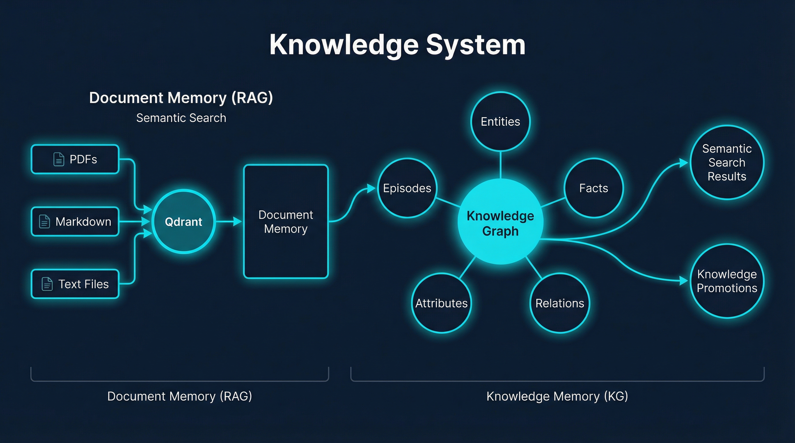

<p align="center"></p>

# Knowledge

> Persistent personal knowledge management system powered by Graphiti knowledge graph - automatically extracts entities, relationships, and temporal context from conversations and documents.

[](https://github.com/madeinoz67/madeinoz-knowledge-system/actions/workflows/ci.yml)
[](https://github.com/madeinoz67/madeinoz-knowledge-system/security/code-scanning)
[](https://github.com/madeinoz67/madeinoz-knowledge-system/releases/latest)
[](https://ghcr.io/madeinoz67/madeinoz-knowledge-system)

## Changelog

**Latest: v1.7.2**

See [CHANGELOG.md](CHANGELOG.md) for full version history.

## Documentation

**[View Full Documentation](https://madeinoz67.github.io/madeinoz-knowledge-system/)** - Complete guides, architecture, and reference.

| Topic | Description |
|-------|-------------|
| [Getting Started](https://madeinoz67.github.io/madeinoz-knowledge-system/getting-started/) | Installation and quick start guide |
| [Configuration](https://madeinoz67.github.io/madeinoz-knowledge-system/reference/configuration/) | Environment variables and settings |
| [Architecture](https://madeinoz67.github.io/madeinoz-knowledge-system/reference/architecture/) | System design and components |
| [Troubleshooting](https://madeinoz67.github.io/madeinoz-knowledge-system/troubleshooting/) | Common issues and solutions |
| [Developer Notes](https://madeinoz67.github.io/madeinoz-knowledge-system/reference/developer-notes/) | Contributing and development |

## Installation

See [INSTALL.md](INSTALL.md) for complete installation instructions, performance benchmarks, and [VERIFY.md](VERIFY.md) for verification checklist.

## Features

- **Automatic Entity Extraction** - LLM-powered extraction of people, organizations, concepts, and more
- **Relationship Mapping** - Automatically discovers connections between entities
- **Semantic Search** - Find knowledge using natural language, not just keywords
- **Memory Decay Scoring** - Automatic memory prioritization with importance/stability classification
- **Weighted Search** - Results ranked by semantic relevance, recency, and importance
- **Lifecycle Management** - Automated memory transitions (ACTIVE → DORMANT → ARCHIVED → EXPIRED)
- **Prometheus Metrics** - Token usage, API costs, cache statistics, and memory health metrics
- **Automated Maintenance** - Scheduled cleanup of expired memories
- **Grafana Dashboards** - Visualize knowledge, token usage, graph stats and memory health
- **Temporal Tracking** - Know when knowledge was captured and how it evolves
- **Memory Sync** - Auto-syncs learnings from PAI Memory System

## Usage

The skill triggers automatically based on natural language:

| Say This | Action |
|----------|--------|
| "remember that X" | Capture knowledge with entity extraction |
| "what do I know about X" | Semantic search for related entities |
| "how are X and Y related" | Find relationships between concepts |
| "what did I learn today" | **Temporal search** - filter by date |
| "recent learnings" | Retrieve recent knowledge additions |
| "knowledge status" | Check system health |

### Temporal Search

Filter search results by date with `--since` and `--until`:

```bash
# Today's knowledge
bun run tools/knowledge-cli.ts search_nodes "topic" --since today

# Last 7 days
bun run tools/knowledge-cli.ts search_facts "decisions" --since 7d

# Date range
bun run tools/knowledge-cli.ts search_nodes "project" --since 2026-01-01 --until 2026-01-15
```

**Date formats:** `today`, `yesterday`, `7d`, `1w`, `1m`, or ISO dates (`2026-01-26`)

## What's Included

| Component | Purpose |
|-----------|---------|
| `SKILL.md` | PAI skill with intent-based routing |
| `src/skills/workflows/` | 8 workflows (Capture, Search, SearchByDate, Facts, Recent, Status, Clear, BulkImport) |
| `src/skills/tools/` | Server management scripts (start, stop, status, logs) |
| `src/hooks/` | Memory sync hook for automatic knowledge capture |
| `docker/` | Docker/Podman compose files for Neo4j and FalkorDB |

## Database Backends

| Backend | Web UI | Best For |
|---------|--------|----------|
| **Neo4j** (default and recommended) | <http://localhost:7474> | Rich queries, special character handling |
| **FalkorDB** (experimental) | <http://localhost:3000> | Simple setup, lower resources |

## For AI Agents

This is a **PAI Pack** - a complete, self-contained module for Personal AI Infrastructure:

1. Read the entire README to understand what you're installing
2. Follow [INSTALL.md](INSTALL.md) step-by-step
3. Complete ALL verification checks in [VERIFY.md](VERIFY.md)
4. If any step fails, STOP and troubleshoot before continuing

## Credits

- **Knowledge graph engine**: [Graphiti](https://github.com/getzep/graphiti) by Zep AI
- **Graph databases**: [Neo4j](https://neo4j.com/), [FalkorDB](https://www.falkordb.com/)
- **Built for**: [Personal AI Infrastructure (PAI)](https://github.com/danielmiessler/PAI)

See full [Acknowledgments](https://madeinoz67.github.io/madeinoz-knowledge-system/acknowledgments) for credits to the community and research that inspired this system.

## Related

- [PAI Memory System](https://github.com/danielmiessler/PAI) - Auto-syncs learnings to knowledge graph
- [PAI Research Skill](https://github.com/danielmiessler/PAI) - Capture research findings

---

*For detailed documentation, visit the [full docs](https://madeinoz67.github.io/madeinoz-knowledge-system/).*
