# Architecture

The Knowledge System solves the problem of amnesiac AI through **automatic knowledge graph construction**. Instead of requiring manual note-taking, it extracts and structures knowledge as a natural byproduct of conversation.

## Core Architecture


!!! info "Architecture Diagram"

    

    **System Architecture Flow:** User conversation and document text flow through the Knowledge System Skill → Intent Routing → Graphiti MCP Server (with Memory Decay) → Graph Database Backend (Neo4j/FalkorDB) → Graph Storage (Nodes, Edges, Episodes, Indices)

## How It Works

### 1. Natural Capture

Say "remember that Podman volumes use host:container syntax" and the system:

- Extracts entities: "Podman", "volume mounting"
- Identifies relationship: "uses", "syntax rule"
- Classifies importance and stability (Feature 009)
- Creates episode with full context
- Stores in graph with timestamp

### 2. Semantic Search

Ask "what do I know about container orchestration?" and the system:

- Searches vector embeddings for related concepts
- Applies weighted scoring: semantic (60%) + recency (25%) + importance (15%)
- Returns entities: "Podman", "Kubernetes", "Docker Compose"
- Shows relationships: "alternatives to", "similar tools"
- Displays episodes with full context

### 3. Relationship Discovery

Ask "how are FalkorDB and Graphiti connected?" and the system:

- Traverses graph edges between entities
- Returns: "FalkorDB is the graph database backend for Graphiti"
- Shows temporal context: "learned on 2025-01-03"
- Displays related entities and connections

## Design Principles

1. **Zero Friction**: Capture knowledge through natural conversation
2. **Automatic Extraction**: LLM-powered entity and relationship detection
3. **Semantic Understanding**: Vector embeddings enable concept-based search
4. **Temporal Tracking**: Know when knowledge was added and how it evolves
5. **Graph-Based**: Explicit relationships show how concepts connect
6. **Memory Prioritization**: Automatic importance/stability classification with decay scoring (Feature 009)
7. **Complete**: Every component included - MCP server, PAI skill, workflows

## Multi-Layered Architecture

The system uses progressive abstraction across multiple layers:


!!! info "Multi-Layered Architecture"

    The system uses progressive abstraction across 6 layers:

    **Layer 1 - User Intent:** Natural language triggers ("remember this", "what do I know", "how are X and Y")

    **Layer 2 - PAI Skill Routing:** SKILL.md frontmatter → Intent Detection → Workflow routing

    **Layer 3 - Workflow Execution:** CaptureEpisode, SearchKnowledge, SearchFacts, GetRecent

    **Layer 4 - MCP Server Integration:** SSE Endpoint (localhost:8000/sse) → add_memory, search_memory_nodes, search_memory_facts, get_episodes

    **Layer 5 - Graphiti Knowledge Graph:** LLM Processing → Entity Extraction → Relationship Mapping → Memory Decay → Vector Embeddings

    **Layer 6 - Graph Database:** Nodes (Entities + Embeddings), Edges (Typed Relationships), Episodes (Full Context), Indices (Vector + Keyword)
```

## Architectural Advantages

### 1. Separation of Concerns

Each layer has a single responsibility:

- **Intent Layer**: Natural language understanding
- **Routing Layer**: Direct user intent to workflow
- **Workflow Layer**: Operational procedures
- **Server Layer**: API abstraction
- **Graph Layer**: Knowledge operations
- **Database Layer**: Persistent storage

This is FUNDAMENTALLY DIFFERENT from "just storing notes" because:

- Progressive abstraction (not everything in one layer)
- Explicit intent routing (not fuzzy keyword matching)
- Separation of operations (capture, search, retrieve distinct)
- Deterministic execution (workflows map intent to MCP calls)

### 2. Bidirectional Knowledge Flow

```mermaid
flowchart TB
    subgraph Capture["⬇️ CAPTURE PATH"]
        direction TB
        U1["👤 User says<br/>'Remember X'"]
        U1 --> CE["📝 Capture Episode"]
        CE --> EE["🔍 Extract Entities"]
        EE --> CR["🔗 Create Relationships"]
        CR --> SG["💾 Store in Graph"]
    end

    subgraph Retrieval["⬆️ RETRIEVAL PATH"]
        direction TB
        GQ["📊 Graph Query"]
        GQ --> SS["🎯 Semantic Similarity"]
        SS --> VS["🔎 Vector Search"]
        VS --> SR["📋 Search Results"]
        SR --> U2["👤 User asks<br/>'What about X'"]
    end

    SG -.->|"Knowledge<br/>compounds<br/>over time"| GQ

    style Capture fill:#c8e6c9,stroke:#2e7d32,stroke-width:2px
    style Retrieval fill:#bbdefb,stroke:#1565c0,stroke-width:2px
    style U1 fill:#fff9c4,stroke:#f9a825
    style U2 fill:#fff9c4,stroke:#f9a825
```



??? note "ASCII Diagram (Text-Only View)"
    ```
User → "Remember X" → Capture Episode → Extract Entities → Create Relationships → Store in Graph
                                                                                  ↓
    User ← "What about X" ← Search Results ← Vector Search ← Semantic Similarity ← Graph Query
    ```

Every knowledge addition improves future retrieval. Every search result can trigger new knowledge capture.

### 3. Multi-Dimensional Retrieval

Traditional search: Keyword matching in flat text
Knowledge graph: Three retrieval dimensions

| Dimension | Mechanism | Example Query | Result Type |
|-----------|-----------|---------------|-------------|
| **Semantic** | Vector embeddings | "container orchestration" | Podman, Kubernetes, Docker |
| **Relational** | Graph traversal | "how are X and Y related" | "X uses Y as backend" |
| **Temporal** | Episode timestamps | "what did I learn about X" | Chronological episodes |

### 4. Automatic Entity Extraction

LLM-powered extraction identifies:

- **Named Entities**: People, organizations, locations
- **Abstract Concepts**: Technologies, methodologies, patterns
- **Procedural Knowledge**: Workflows, SOPs, how-to guides
- **Preferences**: Choices, configurations, opinions
- **Requirements**: Features, needs, specifications

This happens AUTOMATICALLY - no manual tagging required.

### 5. Temporal Context Tracking

Every episode includes:

- Timestamp: When knowledge was added
- Source: Conversation or document
- Entity State: How understanding evolved
- Relationship Creation: When connections were made

Example: "FalkorDB backend for Graphiti (learned 2025-01-03, updated 2025-01-05)"

### 6. Lucene Query Sanitization

The knowledge system includes automatic query sanitization to handle special characters in search terms, particularly important for CTI/OSINT data with hyphenated identifiers (e.g., `apt-28`, `threat-intel`).

!!! note "Full Documentation"
    For detailed information about Lucene query sanitization, including the problem, solution, and sanitization functions, see the [Known Issues](../troubleshooting/known-issues.md#lucene-query-sanitization) page.

## Component Stack

The architecture includes every component needed for end-to-end operation:

- ✅ **MCP Server**: `bun run server-cli start` starts Graphiti + Neo4j/FalkorDB
- ✅ **PAI Skill**: `SKILL.md` with intent routing
- ✅ **Workflows**: 7 complete operational procedures
- ✅ **Installation**: Step-by-step in `tools/Install.md`
- ✅ **Configuration**: All settings in PAI config (`$PAI_DIR/.env`)
- ✅ **Documentation**: README, INSTALL, VERIFY
- ✅ **Query Sanitization**: Handles special characters automatically

NOT: "You need to set up your own vector database" - FalkorDB is included
NOT: "Implement your own entity extraction" - Graphiti handles it
NOT: "Configure your own embeddings" - OpenAI integration built-in
NOT: "Handle special characters manually" - Lucene sanitization built-in

## Knowledge Architecture Innovation

The key insight is that **knowledge is relational, not transactional**. Traditional note-taking treats each piece of information as an isolated transaction. The Madeinoz Knowledge System treats knowledge as a graph of interconnected entities with temporal context.

This isn't just "better search" - it's a fundamentally different paradigm:

- **Transaction**: "Note about Podman volumes" (isolated, static)
- **Relational**: "Podman → uses → volume mounting → syntax → host:container" (connected, queryable, temporal)

The graph structure allows queries impossible with flat notes:

- "Show me all technologies related to container orchestration I learned about in the past month"
- "What debugging solutions led to architectural decisions?"
- "How do my preferences for dev tools relate to past troubleshooting sessions?"
- "Find all CTI indicators from group 'apt-28'"

This architecture makes your AI infrastructure genuinely intelligent, not just a better filing cabinet.

## Problems This Architecture Prevents

| Problem | Traditional Approach | Knowledge Graph Approach |
|---------|---------------------|-------------------------|
| **Keyword limits** | Must know exact terms | Semantic similarity finds related concepts |
| **Siloed information** | Notes in separate files | Graph connects everything |
| **Lost context** | No temporal tracking | Every episode has timestamp |
| **No relationships** | Flat documents | Explicit edges between entities |
| **Manual organization** | Tag and categorize yourself | Automatic entity extraction |
| **Scattered knowledge** | Multiple tools | Single unified graph |
| **Hyphenated identifiers** | Query syntax errors | Automatic sanitization |
