# Architecture

The Madeinoz Knowledge System solves the problem of amnesiac AI through **automatic knowledge graph construction**. Instead of requiring manual note-taking, it extracts and structures knowledge as a natural byproduct of conversation.

## Core Architecture

```mermaid
flowchart TB
    subgraph Input["📝 User Input"]
        UC[User Conversation]
        DOC[Document Import]
    end

    subgraph Skill["🎯 Madeinoz Knowledge System Skill"]
        IR[Intent Routing]
        IR --> |"remember this"| CAP[Capture Workflow]
        IR --> |"what do I know"| SEARCH[Search Workflow]
        IR --> |"how are X and Y"| FACTS[Facts Workflow]
        IR --> |"recent additions"| RECENT[Recent Workflow]
    end

    subgraph MCP["⚙️ Graphiti MCP Server"]
        direction TB
        LLM["LLM Extraction<br/>gpt-4o-mini / gpt-4o"]
        LLM --> ENT["Entity Extraction<br/>People, Organizations,<br/>Concepts, Locations"]
        LLM --> REL["Relationship Mapping<br/>Causal, Dependency,<br/>Temporal, Semantic"]
        ENT --> VEC["Vector Embeddings<br/>text-embedding-3-small"]
        REL --> VEC
    end

    subgraph DB["💾 Graph Database Backend"]
        direction LR
        subgraph Neo4j["Neo4j (Default)"]
            N1[Native Graph DB]
            N2[Cypher Queries]
            N3[Browser :7474]
        end
        subgraph Falkor["FalkorDB (Alternative)"]
            F1[Redis-based]
            F2[RediSearch Queries]
            F3[Web UI :3000]
        end
    end

    subgraph Storage["📊 Graph Storage"]
        NODES[Nodes<br/>Entities with embeddings]
        EDGES[Edges<br/>Typed relationships]
        EPISODES[Episodes<br/>Full context + timestamps]
        INDICES[Indices<br/>Vector + keyword search]
    end

    UC --> IR
    DOC --> IR
    CAP --> MCP
    SEARCH --> MCP
    FACTS --> MCP
    RECENT --> MCP
    VEC --> DB
    Neo4j --> Storage
    Falkor --> Storage

    style Input fill:#e1f5fe,stroke:#01579b
    style Skill fill:#f3e5f5,stroke:#4a148c
    style MCP fill:#fff3e0,stroke:#e65100
    style DB fill:#e8f5e9,stroke:#1b5e20
    style Storage fill:#fce4ec,stroke:#880e4f
```



??? note "ASCII Diagram (Text-Only View)"
    ```
    User Conversation/Document
             │
             ▼
    ┌─────────────────────────────────┐
    │   Madeinoz Knowledge System Skill    │
    │  ┌───────────────────────────┐  │
    │  │   Intent Routing          │  │
    │  │   - "remember this"       │  │
    │  │   - "what do I know"      │  │
    │  │   - "how are X and Y...   │  │
    │  └───────────┬───────────────┘  │
    └───────────────┼──────────────────┘
                    │
                    ▼
    ┌─────────────────────────────────┐
    │   Graphiti MCP Server           │
    │  ┌───────────────────────────┐  │
    │  │   LLM-Based Extraction    │  │
    │  │   - Entities (People,     │  │
    │  │     Organizations,        │  │
    │  │     Concepts, Places)     │  │
    │  │   - Relationships         │  │
    │  │   - Temporal Context      │  │
    │  └───────────┬───────────────┘  │
    │             │                    │
    │  ┌──────────▼───────────────┐  │
    │  │   Vector Embeddings      │  │
    │  │   - OpenAI embeddings    │  │
    │  │   - Semantic similarity  │  │
    │  └──────────┬───────────────┘  │
    └─────────────┼──────────────────┘
                  │
                  ▼
    ┌─────────────────────────────────┐
    │   Graph Database Backend        │
    │  ┌───────────────────────────┐  │
    │  │  Neo4j (default)          │  │
    │  │   - Native graph DB       │  │
    │  │   - Cypher queries        │  │
    │  │   - Browser :7474         │  │
    │  ├───────────────────────────┤  │
    │  │  FalkorDB (alternative)   │  │
    │  │   - Redis-based           │  │
    │  │   - RediSearch queries    │  │
    │  │   - Web UI :3000          │  │
    │  └───────────────────────────┘  │
    │  Nodes, Edges, Episodes, Indices│
    └─────────────────────────────────┘
    ```

## How It Works

### 1. Natural Capture

Say "remember that Podman volumes use host:container syntax" and the system:
- Extracts entities: "Podman", "volume mounting"
- Identifies relationship: "uses", "syntax rule"
- Creates episode with full context
- Stores in graph with timestamp

### 2. Semantic Search

Ask "what do I know about container orchestration?" and the system:
- Searches vector embeddings for related concepts
- Returns entities: "Podman", "Kubernetes", "Docker Compose"
- Shows relationships: "alternatives to", "similar tools"
- Displays episodes with full context

### 3. Relationship Discovery

Ask "how are FalkorDB and Graphiti connected?" and the system:
- Traverses graph edges between entities
- Returns: "FalkorDB is the graph database backend for Graphiti"
- Shows temporal context: "learned on 2025-01-03"
- Displays related entities and connections

## Design Principles

1. **Zero Friction**: Capture knowledge through natural conversation
2. **Automatic Extraction**: LLM-powered entity and relationship detection
3. **Semantic Understanding**: Vector embeddings enable concept-based search
4. **Temporal Tracking**: Know when knowledge was added and how it evolves
5. **Graph-Based**: Explicit relationships show how concepts connect
6. **Complete**: Every component included - MCP server, PAI skill, workflows

## Multi-Layered Architecture

The system uses progressive abstraction across multiple layers:

```mermaid
flowchart TB
    subgraph L1["🗣️ Layer 1: User Intent"]
        UI["Natural Language Triggers"]
        UI --> T1["'remember this'"]
        UI --> T2["'what do I know about X'"]
        UI --> T3["'how are X and Y related'"]
    end

    subgraph L2["🎯 Layer 2: PAI Skill Routing"]
        SKILL["SKILL.md Frontmatter"]
        SKILL --> ID["Intent Detection"]
        ID --> UW["USE WHEN Clauses"]
        UW --> RT["Route to Workflow"]
    end

    subgraph L3["⚡ Layer 3: Workflow Execution"]
        direction LR
        subgraph W1["CaptureEpisode"]
            CE1[Add Episode]
            CE2[Extract Entities]
            CE3[Create Relationships]
        end
        subgraph W2["SearchKnowledge"]
            SK1[Vector Search]
            SK2[Return Entities]
            SK3[Summarize]
        end
        subgraph W3["SearchFacts"]
            SF1[Traverse Edges]
            SF2[Return Connections]
        end
        subgraph W4["GetRecent"]
            GR1[Temporal Query]
            GR2[Show Progression]
        end
    end

    subgraph L4["🔌 Layer 4: MCP Server Integration"]
        SSE["SSE Endpoint<br/>localhost:8000/sse"]
        SSE --> AM["add_memory"]
        SSE --> SMN["search_memory_nodes"]
        SSE --> SMF["search_memory_facts"]
        SSE --> GE["get_episodes"]
        SSE --> MGT["delete/clear"]
    end

    subgraph L5["🧠 Layer 5: Graphiti Knowledge Graph"]
        LLM["LLM Processing<br/>OpenAI / Compatible"]
        LLM --> EXT["Entity Extraction<br/>People, Orgs, Concepts,<br/>Locations, Procedures"]
        EXT --> REL["Relationship Mapping<br/>Causal, Dependency,<br/>Temporal, Semantic"]
        REL --> VEC["Vector Embeddings<br/>text-embedding-3-small"]
    end

    subgraph L6["💾 Layer 6: Graph Database"]
        direction LR
        NODES["Nodes<br/>Entities + Embeddings"]
        EDGES["Edges<br/>Typed Relationships"]
        EPISODES["Episodes<br/>Full Context"]
        INDICES["Indices<br/>Vector + Keyword"]
    end

    L1 --> L2
    L2 --> L3
    L3 --> L4
    L4 --> L5
    L5 --> L6

    style L1 fill:#e3f2fd,stroke:#1565c0
    style L2 fill:#f3e5f5,stroke:#7b1fa2
    style L3 fill:#fff3e0,stroke:#ef6c00
    style L4 fill:#e8f5e9,stroke:#2e7d32
    style L5 fill:#fce4ec,stroke:#c2185b
    style L6 fill:#f5f5f5,stroke:#424242
```



??? note "ASCII Diagram (Text-Only View)"
    ```
    ┌─────────────────────────────────────────────────────────────┐
    │                    User Intent Layer                        │
    │  Natural language triggers: "remember this", "what do I     │
    │  know about X", "how are X and Y related"                  │
    └────────────────────────┬────────────────────────────────────┘
                             │
                             ▼
    ┌─────────────────────────────────────────────────────────────┐
    │                  PAI Skill Routing Layer                    │
    │  ┌──────────────────────────────────────────────────────┐  │
    │  │  SKILL.md Frontmatter → Intent Detection             │  │
    │  │  - USE WHEN clauses trigger based on user phrases    │  │
    │  │  - Routes to appropriate workflow                    │  │
    │  └──────────────────────────────────────────────────────┘  │
    └────────────────────────┬────────────────────────────────────┘
                             │
                             ▼
    ┌─────────────────────────────────────────────────────────────┐
    │                   Workflow Execution Layer                   │
    │  ┌──────────────────┐  ┌──────────────────┐               │
    │  │  CaptureEpisode  │  │  SearchKnowledge │               │
    │  │  - Adds episode  │  │  - Vector search │               │
    │  │  - Extracts      │  │  - Returns       │               │
    │  │    entities      │  │    entities +    │               │
    │  │  - Creates       │  │    summaries     │               │
    │  │    relationships │  │                  │               │
    │  └──────────────────┘  └──────────────────┘               │
    │                                                         │
    │  ┌──────────────────┐  ┌──────────────────┐               │
    │  │  SearchFacts     │  │  GetRecent       │               │
    │  │  - Traverses     │  │  - Temporal      │               │
    │  │    graph edges   │  │    queries       │               │
    │  │  - Returns       │  │  - Shows         │               │
    │  │    connections   │  │    progression   │               │
    │  └──────────────────┘  └──────────────────┘               │
    └────────────────────────┬────────────────────────────────────┘
                             │
                             ▼
    ┌─────────────────────────────────────────────────────────────┐
    │              MCP Server Integration Layer                   │
    │  ┌──────────────────────────────────────────────────────┐  │
    │  │  SSE Endpoint: localhost:8000/sse                    │  │
    │  │  - add_memory: Store knowledge                       │  │
    │  │  - search_memory_nodes: Semantic entity search       │  │
    │  │  - search_memory_facts: Relationship traversal       │  │
    │  │  - get_episodes: Temporal retrieval                  │  │
    │  │  - delete_episode/clear_graph: Management            │  │
    │  └──────────────────────────────────────────────────────┘  │
    └────────────────────────┬────────────────────────────────────┘
                             │
                             ▼
    ┌─────────────────────────────────────────────────────────────┐
    │              Graphiti Knowledge Graph Layer                 │
    │  ┌──────────────────────────────────────────────────────┐  │
    │  │  LLM Processing (OpenAI/compatible)                  │  │
    │  │  ┌────────────────────────────────────────────────┐ │  │
    │  │  │  Entity Extraction                             │ │  │
    │  │  │  - People, Organizations, Locations            │ │  │
    │  │  │  - Concepts, Preferences, Requirements         │ │  │
    │  │  │  - Procedures, Events, Documents               │ │  │
    │  │  └────────────────────────────────────────────────┘ │  │
    │  │                     │                               │  │
    │  │  ┌──────────────────▼─────────────────────────────┐ │  │
    │  │  │  Relationship Mapping                          │ │  │
    │  │  │  - Causal: X caused Y                          │ │  │
    │  │  │  - Dependency: X requires Y                    │ │  │
    │  │  │  - Temporal: X happened before Y               │ │  │
    │  │  │  - Semantic: X is related to Y                 │ │  │
    │  │  └────────────────────────────────────────────────┘ │  │
    │  │                     │                               │  │
    │  │  ┌──────────────────▼─────────────────────────────┐ │  │
    │  │  │  Vector Embeddings                             │ │  │
    │  │  │  - OpenAI text-embedding-3-small               │ │  │
    │  │  │  - Semantic similarity search                  │ │  │
    │  │  │  - Hybrid: vector + keyword                    │ │  │
    │  │  └────────────────────────────────────────────────┘ │  │
    │  └──────────────────────────────────────────────────────┘  │
    └────────────────────────┬────────────────────────────────────┘
                             │
                             ▼
    ┌─────────────────────────────────────────────────────────────┐
    │           Graph Database (Neo4j/FalkorDB)                   │
    │  ┌──────────────────────────────────────────────────────┐  │
    │  │  Nodes: Entities with embeddings and metadata        │  │
    │  │  Edges: Typed relationships with timestamps          │  │
    │  │  Episodes: Full conversation context                │  │
    │  │  Indices: Vector search, entity lookup, time        │  │
    │  └──────────────────────────────────────────────────────┘  │
    └─────────────────────────────────────────────────────────────┘
    ```

## Architectural Advantages

### 1. Separation of Concerns

Each layer has a single responsibility:
- **Intent Layer**: Natural language understanding
- **Routing Layer**: Direct user intent to workflow
- **Workflow Layer**: Operational procedures
- **Server Layer**: API abstraction
- **Graph Layer**: Knowledge operations
- **Database Layer**: Persistent storage

This is FUNDAMENTALLY DIFFERENT from "just storing notes" because:
- Progressive abstraction (not everything in one layer)
- Explicit intent routing (not fuzzy keyword matching)
- Separation of operations (capture, search, retrieve distinct)
- Deterministic execution (workflows map intent to MCP calls)

### 2. Bidirectional Knowledge Flow

```mermaid
flowchart TB
    subgraph Capture["⬇️ CAPTURE PATH"]
        direction TB
        U1["👤 User says<br/>'Remember X'"]
        U1 --> CE["📝 Capture Episode"]
        CE --> EE["🔍 Extract Entities"]
        EE --> CR["🔗 Create Relationships"]
        CR --> SG["💾 Store in Graph"]
    end

    subgraph Retrieval["⬆️ RETRIEVAL PATH"]
        direction TB
        GQ["📊 Graph Query"]
        GQ --> SS["🎯 Semantic Similarity"]
        SS --> VS["🔎 Vector Search"]
        VS --> SR["📋 Search Results"]
        SR --> U2["👤 User asks<br/>'What about X'"]
    end

    SG -.->|"Knowledge<br/>compounds<br/>over time"| GQ

    style Capture fill:#c8e6c9,stroke:#2e7d32,stroke-width:2px
    style Retrieval fill:#bbdefb,stroke:#1565c0,stroke-width:2px
    style U1 fill:#fff9c4,stroke:#f9a825
    style U2 fill:#fff9c4,stroke:#f9a825
```



??? note "ASCII Diagram (Text-Only View)"
    ```
    User → "Remember X" → Capture Episode → Extract Entities → Create Relationships → Store in Graph
                                                                                  ↓
    User ← "What about X" ← Search Results ← Vector Search ← Semantic Similarity ← Graph Query
    ```

Every knowledge addition improves future retrieval. Every search result can trigger new knowledge capture.

### 3. Multi-Dimensional Retrieval

Traditional search: Keyword matching in flat text
Knowledge graph: Three retrieval dimensions

| Dimension | Mechanism | Example Query | Result Type |
|-----------|-----------|---------------|-------------|
| **Semantic** | Vector embeddings | "container orchestration" | Podman, Kubernetes, Docker |
| **Relational** | Graph traversal | "how are X and Y related" | "X uses Y as backend" |
| **Temporal** | Episode timestamps | "what did I learn about X" | Chronological episodes |

### 4. Automatic Entity Extraction

LLM-powered extraction identifies:
- **Named Entities**: People, organizations, locations
- **Abstract Concepts**: Technologies, methodologies, patterns
- **Procedural Knowledge**: Workflows, SOPs, how-to guides
- **Preferences**: Choices, configurations, opinions
- **Requirements**: Features, needs, specifications

This happens AUTOMATICALLY - no manual tagging required.

### 5. Temporal Context Tracking

Every episode includes:
- Timestamp: When knowledge was added
- Source: Conversation or document
- Entity State: How understanding evolved
- Relationship Creation: When connections were made

Example: "FalkorDB backend for Graphiti (learned 2025-01-03, updated 2025-01-05)"

### 6. Lucene Query Sanitization

The knowledge system includes automatic query sanitization to handle special characters in search terms, particularly important for CTI/OSINT data with hyphenated identifiers (e.g., `apt-28`, `threat-intel`).

!!! note "Full Documentation"
    For detailed information about Lucene query sanitization, including the problem, solution, and sanitization functions, see the [Known Issues](../troubleshooting/known-issues.md#lucene-query-sanitization) page.

## Component Stack

The architecture includes every component needed for end-to-end operation:

- ✅ **MCP Server**: `bun run server-cli start` starts Graphiti + Neo4j/FalkorDB
- ✅ **PAI Skill**: `SKILL.md` with intent routing
- ✅ **Workflows**: 7 complete operational procedures
- ✅ **Installation**: Step-by-step in `tools/Install.md`
- ✅ **Configuration**: All settings in PAI config (`$PAI_DIR/.env`)
- ✅ **Documentation**: README, INSTALL, VERIFY
- ✅ **Query Sanitization**: Handles special characters automatically

NOT: "You need to set up your own vector database" - FalkorDB is included
NOT: "Implement your own entity extraction" - Graphiti handles it
NOT: "Configure your own embeddings" - OpenAI integration built-in
NOT: "Handle special characters manually" - Lucene sanitization built-in

## Knowledge Architecture Innovation

The key insight is that **knowledge is relational, not transactional**. Traditional note-taking treats each piece of information as an isolated transaction. The Madeinoz Knowledge System treats knowledge as a graph of interconnected entities with temporal context.

This isn't just "better search" - it's a fundamentally different paradigm:
- **Transaction**: "Note about Podman volumes" (isolated, static)
- **Relational**: "Podman → uses → volume mounting → syntax → host:container" (connected, queryable, temporal)

The graph structure allows queries impossible with flat notes:
- "Show me all technologies related to container orchestration I learned about in the past month"
- "What debugging solutions led to architectural decisions?"
- "How do my preferences for dev tools relate to past troubleshooting sessions?"
- "Find all CTI indicators from group 'apt-28'"

This architecture makes your AI infrastructure genuinely intelligent, not just a better filing cabinet.

## Problems This Architecture Prevents

| Problem | Traditional Approach | Knowledge Graph Approach |
|---------|---------------------|-------------------------|
| **Keyword limits** | Must know exact terms | Semantic similarity finds related concepts |
| **Siloed information** | Notes in separate files | Graph connects everything |
| **Lost context** | No temporal tracking | Every episode has timestamp |
| **No relationships** | Flat documents | Explicit edges between entities |
| **Manual organization** | Tag and categorize yourself | Automatic entity extraction |
| **Scattered knowledge** | Multiple tools | Single unified graph |
| **Hyphenated identifiers** | Query syntax errors | Automatic sanitization |
