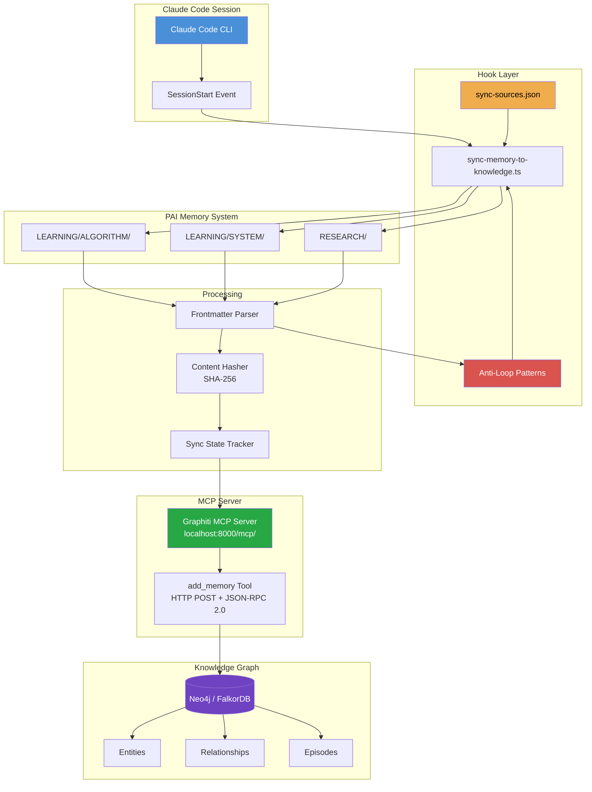
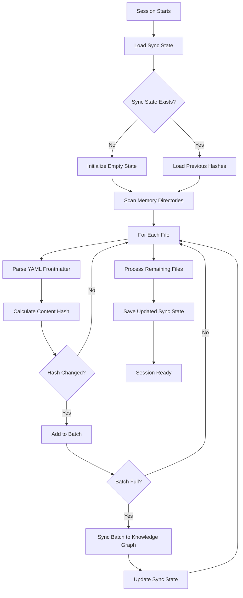

<!-- AI-FRIENDLY SUMMARY
System: Memory Sync Hook
Purpose: Automatically syncs PAI Memory files to knowledge graph at session start

Key Features:
- Configurable sync sources (LEARNING/ALGORITHM, LEARNING/SYSTEM, RESEARCH)
- Anti-loop detection prevents knowledge query results from being re-synced
- Custom exclude patterns via config file or environment variable
- Content-based deduplication using SHA-256 hashes

Configuration File: ~/.claude/config/sync-sources.json (installed) or config/sync-sources.json (development)
Environment Prefix: MADEINOZ_KNOWLEDGE_SYNC_*

Key Environment Variables:
- MADEINOZ_KNOWLEDGE_SYNC_LEARNING_ALGORITHM: Enable/disable LEARNING/ALGORITHM sync (default: true)
- MADEINOZ_KNOWLEDGE_SYNC_LEARNING_SYSTEM: Enable/disable LEARNING/SYSTEM sync (default: true)
- MADEINOZ_KNOWLEDGE_SYNC_RESEARCH: Enable/disable RESEARCH sync (default: true)
- MADEINOZ_KNOWLEDGE_SYNC_EXCLUDE_PATTERNS: Comma-separated patterns (overrides config file)
- MADEINOZ_KNOWLEDGE_SYNC_MAX_FILES: Max files per sync run (default: 50)
- MADEINOZ_KNOWLEDGE_SYNC_VERBOSE: Enable verbose logging (default: false)

CLI Commands:
- bun run src/hooks/sync-memory-to-knowledge.ts --status: Show sync status
- bun run src/hooks/sync-memory-to-knowledge.ts --all: Sync all files
- bun run src/hooks/sync-memory-to-knowledge.ts --dry-run: Preview without syncing

Anti-Loop Patterns (16 built-in):
- MCP tool invocations: mcp__madeinoz-knowledge__
- Query phrases: "what do I know about", "search my knowledge"
- Formatted output: "Knowledge Found:", "Key Entities:"
-->

# Hooks & PAI Memory Integration

## Overview

The madeinoz-knowledge-system seamlessly integrates with the **PAI Memory System** through automated session lifecycle hooks. This integration ensures your learning, research, and system improvements are automatically captured in your personal knowledge graph without manual intervention.

**Hooks** are automated scripts that run at specific points in your Claude Code session lifecycle. They enable zero-effort knowledge capture by monitoring PAI Memory directories and syncing new or updated content to your knowledge graph.

!!! info "Zero-Effort Knowledge Capture"
    Once configured, the hooks system automatically:

    - Syncs PAI Memory files to your knowledge graph at session start
    - Captures the most recent learnings immediately after session end
    - Prevents duplicate entries using content hashing
    - Handles errors gracefully with retry logic

### Component Stack



## Available Hooks

The system provides a single consolidated hook for memory synchronization:

| Hook | Trigger Point | Purpose | Sync Scope |
|------|--------------|---------|------------|
| **sync-memory-to-knowledge** | `SessionStart` | Comprehensive sync of all configured PAI Memory files | Configurable (LEARNING/ALGORITHM/, LEARNING/SYSTEM/, RESEARCH/) |

### sync-memory-to-knowledge (SessionStart Hook)

This hook performs comprehensive synchronization when you start a new Claude Code session. It scans all configured memory directories and syncs any new or modified files to your knowledge graph.

**Key Features:**

- **Configurable sync sources** - Enable/disable each directory via environment variables or config file
- **Anti-loop detection** - Prevents knowledge query results from being re-synced (16 built-in patterns)
- **Custom exclude patterns** - Add your own patterns to skip specific content
- Full directory scanning across all enabled memory sources
- Batched processing for efficiency
- YAML frontmatter metadata extraction
- Content-based deduplication (SHA-256)
- Exponential backoff retry logic
- Dry-run mode for testing
- Status command for visibility

## PAI Memory Integration

The hooks system integrates with the [PAI Memory System v7.0](https://github.com/danielmiessler/PAI), which organizes AI-assisted learning into structured markdown files with YAML frontmatter.

### Memory Directory Structure

```text
~/.claude/MEMORY/
├── LEARNING/
│   ├── ALGORITHM/          # Improvements to The Algorithm
│   └── SYSTEM/             # System-level learnings
└── RESEARCH/               # Research findings and analysis
```

### YAML Frontmatter Parsing

Each PAI Memory file contains structured metadata in YAML frontmatter that enriches the knowledge graph:

```yaml
---
title: "Advanced Error Handling Patterns"
tags: ["error-handling", "resilience", "typescript"]
source: "Production debugging session"
confidence: high
date: 2026-01-19
---

# Learning content here...
```

The hooks extract this metadata and pass it to the knowledge graph as structured context, enabling:

- **Rich semantic search** using title and tags
- **Source attribution** for provenance tracking
- **Confidence filtering** for quality assessment
- **Temporal organization** using date metadata

## Sync Sources

The hooks monitor three distinct PAI Memory directories, each serving a specific purpose:

### 1. LEARNING/ALGORITHM/

**Purpose:** Captures improvements and refinements to "The Algorithm" - the core problem-solving methodology used by PAI agents.

**Content Types:**

- New reasoning patterns discovered during sessions
- Refinements to existing problem-solving steps
- Meta-learnings about effective approaches
- Algorithm performance optimizations

**Why Sync This?** Algorithm learnings represent your highest-value knowledge—they're the distilled insights about *how to think* and solve problems effectively. By syncing these to your knowledge graph:

- **Compounding Intelligence**: Each algorithm improvement builds on previous ones; the graph connects related insights across sessions
- **Pattern Discovery**: Semantic search reveals when similar approaches solved different problems
- **Methodology Evolution**: Track how your problem-solving methodology improves over time through temporal queries

**Example File:** `~/.claude/MEMORY/LEARNING/ALGORITHM/debugging-methodology-improvement.md`

### 2. LEARNING/SYSTEM/

**Purpose:** Documents system-level knowledge about tools, configurations, and infrastructure.

**Content Types:**

- Tool usage patterns and best practices
- Configuration discoveries
- Environment-specific learnings
- Integration insights

**Why Sync This?** System learnings prevent you from re-solving the same technical problems. This is the knowledge that saves hours of debugging and configuration headaches:

- **Instant Recall**: Ask "how did I configure MkDocs?" instead of re-reading documentation
- **Cross-Tool Connections**: The graph links related tools (e.g., Podman configurations connect to Docker knowledge)
- **Environment Context**: Learnings about your specific setup—your machine, your tools, your workflows
- **Troubleshooting History**: When something breaks, search for past solutions to similar issues

**Example File:** `~/.claude/MEMORY/LEARNING/SYSTEM/mkdocs-material-configuration.md`

### 3. RESEARCH/

**Purpose:** Stores research findings, competitive analysis, and external knowledge synthesis.

**Content Types:**

- Technology research and evaluations
- Comparative analyses
- Industry trends and patterns
- External documentation summaries

**Why Sync This?** Research represents your curated external knowledge—information you've gathered, evaluated, and found valuable enough to preserve:

- **Decision Support**: When choosing tools or approaches, query past research on similar technologies
- **Knowledge Synthesis**: The graph connects research findings to your learnings, showing how external knowledge influenced your decisions
- **Competitive Intelligence**: Track how your understanding of the landscape evolves
- **Reference Library**: Build a searchable archive of evaluated technologies, patterns, and best practices from the broader ecosystem

**Example File:** `~/.claude/MEMORY/RESEARCH/graphiti-vs-alternatives.md`

## Configurable Sync

The memory sync system is fully configurable through an external JSON configuration file and environment variables.

### Configuration File

Sync sources and custom patterns are defined in `sync-sources.json`:

| Context | Configuration File Location |
|---------|---------------------------|
| **Installed** (via `bun run install:system`) | `~/.claude/config/sync-sources.json` |
| **Development** (running from source) | `{project}/config/sync-sources.json` |

**Example configuration:**

```json
{
  "version": "1.0",
  "sources": [
    {
      "id": "LEARNING_ALGORITHM",
      "path": "LEARNING/ALGORITHM",
      "type": "LEARNING",
      "description": "Task execution learnings",
      "defaultEnabled": true
    },
    {
      "id": "LEARNING_SYSTEM",
      "path": "LEARNING/SYSTEM",
      "type": "LEARNING",
      "description": "PAI/tooling learnings",
      "defaultEnabled": true
    },
    {
      "id": "RESEARCH",
      "path": "RESEARCH",
      "type": "RESEARCH",
      "description": "Agent research outputs",
      "defaultEnabled": true
    }
  ],
  "customExcludePatterns": [
    "meeting notes",
    "/^draft-/i"
  ]
}
```

### Environment Variables

Environment variables override the config file settings:

| Variable | Default | Description |
|----------|---------|-------------|
| `MADEINOZ_KNOWLEDGE_SYNC_LEARNING_ALGORITHM` | `true` | Enable sync for LEARNING/ALGORITHM files |
| `MADEINOZ_KNOWLEDGE_SYNC_LEARNING_SYSTEM` | `true` | Enable sync for LEARNING/SYSTEM files |
| `MADEINOZ_KNOWLEDGE_SYNC_RESEARCH` | `true` | Enable sync for RESEARCH files |
| `MADEINOZ_KNOWLEDGE_SYNC_EXCLUDE_PATTERNS` | - | Comma-separated custom exclude patterns (overrides config file) |
| `MADEINOZ_KNOWLEDGE_SYNC_MAX_FILES` | `50` | Max files per sync run (1-1000) |
| `MADEINOZ_KNOWLEDGE_SYNC_VERBOSE` | `false` | Enable verbose logging |

**Example: Disable RESEARCH sync:**

```bash
export MADEINOZ_KNOWLEDGE_SYNC_RESEARCH=false
```

### Anti-Loop Detection

The system automatically excludes knowledge-derived content from being re-synced to prevent feedback loops. This is critical for preventing infinite sync cycles where knowledge query results get synced back to the knowledge graph.

**16 Built-in Anti-Loop Patterns:**

| Category | Pattern Examples | What It Detects |
|----------|-----------------|-----------------|
| **MCP Tools** | `mcp__madeinoz-knowledge__` | Tool invocation markers |
| **Query Phrases** | `what do I know about`, `search my knowledge` | Natural language queries |
| **Formatted Output** | `Knowledge Found:`, `Key Entities:` | Structured search results |
| **Search Results** | `Related Facts:`, `Source Episodes:` | Query response sections |

When a file matches any anti-loop pattern, it is skipped with a logged reason code.

### Custom Exclude Patterns

You can add your own patterns to exclude specific content from sync. Patterns can be:

**1. Substring patterns** (case-insensitive match anywhere in content):

```json
"customExcludePatterns": [
  "meeting notes",
  "TODO:",
  "DRAFT"
]
```

**2. Regex patterns** (surrounded by `/`, optional flags):

```json
"customExcludePatterns": [
  "/^draft-/i",
  "/\\[WIP\\]/",
  "/meeting-\\d{4}-\\d{2}-\\d{2}/"
]
```

| Pattern Type | Syntax | Example | Matches |
|--------------|--------|---------|---------|
| Substring | `"text"` | `"meeting notes"` | Any file containing "meeting notes" |
| Regex (case-insensitive) | `"/pattern/i"` | `"/^draft-/i"` | Files starting with "draft-" |
| Regex (case-sensitive) | `"/pattern/"` | `"/TODO:/"` | Files containing exactly "TODO:" |

**Precedence:**

1. Environment variable `MADEINOZ_KNOWLEDGE_SYNC_EXCLUDE_PATTERNS` (if set, overrides config file)
2. Config file `customExcludePatterns` array
3. Built-in anti-loop patterns (always active, cannot be disabled)

### CLI Commands

```bash
# Show current sync status and configuration
bun run src/hooks/sync-memory-to-knowledge.ts --status

# Run sync manually
bun run src/hooks/sync-memory-to-knowledge.ts

# Sync all files (not just recent)
bun run src/hooks/sync-memory-to-knowledge.ts --all

# Dry run with verbose output
bun run src/hooks/sync-memory-to-knowledge.ts --dry-run --verbose
```

## How It Works

### SessionStart Sync Flow



### Step-by-Step Process

1. **Trigger Detection** - Hook activates at SessionStart lifecycle point
2. **Configuration Loading** - Reads `sync-sources.json` for enabled sources and custom patterns
3. **State Loading** - Reads `~/.claude/.madeinoz-knowledge-sync-state.json` for previous sync history
4. **File Discovery** - Scans enabled memory directories for `.md` files
5. **Anti-Loop Check** - Skips files matching built-in or custom exclude patterns
6. **Content Hashing** - Calculates SHA-256 hash of each file's content
7. **Change Detection** - Compares current hash against stored state
8. **Frontmatter Parsing** - Extracts YAML metadata (title, tags, source, etc.)
9. **Batch Processing** - Groups files into batches (default: 10 files)
10. **Knowledge Graph Sync** - Calls `add_memory` tool with content and metadata
11. **Retry Logic** - Retries failed syncs with exponential backoff (1s, 2s, 4s delays)
12. **State Persistence** - Updates sync state file with new hashes and timestamps

!!! warning "Anti-Loop Protection"
    The hook automatically detects and skips files containing knowledge query results. This prevents infinite sync cycles where searching the knowledge graph produces output that gets synced back to the graph.

## Deduplication

The hooks system uses **content-based deduplication** to prevent duplicate entries in your knowledge graph, even if you manually re-sync or run multiple sessions.

### How Content Hashing Works

1. **Hash Calculation** - SHA-256 hash computed from full file content (including frontmatter)
2. **State Storage** - Hash stored in `~/.claude/.madeinoz-knowledge-sync-state.json` with file path
3. **Change Detection** - On subsequent syncs, current hash compared to stored hash
4. **Sync Decision** - Only files with changed hashes are synced

### Sync State File Format

```json
{
  "lastSync": "2026-01-19T10:30:00.000Z",
  "files": {
    "/Users/seaton/.claude/MEMORY/LEARNING/ALGORITHM/debugging-methodology.md": {
      "hash": "a1b2c3d4e5f6...",
      "lastModified": "2026-01-19T10:25:00.000Z",
      "syncedAt": "2026-01-19T10:30:00.000Z"
    },
    "/Users/seaton/.claude/MEMORY/LEARNING/SYSTEM/mkdocs-config.md": {
      "hash": "f6e5d4c3b2a1...",
      "lastModified": "2026-01-18T15:20:00.000Z",
      "syncedAt": "2026-01-19T10:30:00.000Z"
    }
  }
}
```

### Benefits

- **No Duplicate Entries** - Each unique content version synced exactly once
- **Efficient Syncing** - Only modified files processed
- **Safe Re-runs** - Can manually trigger hooks without fear of duplication
- **Edit Tracking** - Content updates create new knowledge graph entries with fresh context

!!! tip "Hash Stability"
    The hash is calculated from the entire file content, including frontmatter. Even minor edits (like fixing typos) will trigger a re-sync. This is intentional - it ensures your knowledge graph always reflects the latest version of your learnings.

## MCP Protocol Details

The hooks use a **dual protocol architecture** that automatically adapts to your database backend type. This ensures compatibility with both Neo4j (default) and FalkorDB backends.

### Protocol Selection

The `MADEINOZ_KNOWLEDGE_DB` environment variable determines which MCP protocol the hooks use:

| Database Type | Protocol | Endpoint | Session Management |
|---------------|----------|----------|-------------------|
| `neo4j` (default) | HTTP POST + JSON-RPC 2.0 | `/mcp/` | `Mcp-Session-Id` header |
| `falkorodb` | SSE GET + session messages | `/sse` | Session endpoint from SSE handshake |

### Neo4j Protocol (HTTP POST)

**Flow:**
1. Initialize session: POST to `/mcp/` with `initialize` method
2. Extract `Mcp-Session-Id` from response headers
3. Call tools: POST to `/mcp/` with `tools/call` method, including `Mcp-Session-Id` header
4. Parse response body as SSE format (extract `data:` lines containing JSON)

**Example Request:**
```json
{
  "jsonrpc": "2.0",
  "id": 1,
  "method": "tools/call",
  "params": {
    "name": "add_memory",
    "arguments": {
      "name": "LEARNING: My Learning",
      "episode_body": "Content here...",
      "group_id": "learning"
    }
  }
}
```

### FalkorDB Protocol (SSE GET)

**Flow:**
1. Connect to `/sse` endpoint
2. Receive `endpoint` event with session-specific messages URL
3. Send initialize request to messages URL
4. Send tool calls via POST to messages URL
5. Receive responses via SSE or as JSON

### Query Sanitization

The hooks automatically apply **conditional query sanitization** based on database type:

**FalkorDB (Lucene/RediSearch):**
- Special characters are escaped: `+ - && || ! ( ) { } [ ] ^ " ~ * ? : \ /`
- Critical for CTI/OSINT data with hyphenated identifiers (e.g., `apt-28`, `CVE-2024-1234`)
- Applied automatically by the Docker container at runtime

**Neo4j (Cypher):**
- No escaping needed - native Cypher queries handle special characters naturally
- Query parameters passed through as-is

!!! warning "Protocol Mismatch Prevention"
    The hooks automatically detect your database type and use the correct protocol. If you switch backends, simply update the `MADEINOZ_KNOWLEDGE_DB` environment variable and restart the MCP server.

## Configuration

### Environment Variables

The hooks system respects the same configuration as the main knowledge graph server:

| Variable | Purpose | Default |
|----------|---------|---------|
| `MADEINOZ_KNOWLEDGE_MCP_URL` | Graphiti MCP server base URL | `http://localhost:8000` |
| `MADEINOZ_KNOWLEDGE_DB` | Database backend type (determines protocol) | `neo4j` |
| `MADEINOZ_KNOWLEDGE_TIMEOUT` | Request timeout in milliseconds | `15000` |
| `MADEINOZ_KNOWLEDGE_RETRIES` | Maximum retry attempts for transient failures | `3` |

!!! note "Database Protocol Selection"
    The `MADEINOZ_KNOWLEDGE_DB` environment variable determines which MCP protocol the hooks use:

    - **neo4j** (default): HTTP POST to `/mcp/` endpoint with JSON-RPC 2.0 protocol
    - **falkorodb**: SSE GET to `/sse` endpoint with session-based messaging

    This automatic protocol detection ensures the hooks work correctly with both database backends.

### Hook-Specific Settings

These settings are configured in the hook source files:

**sync-memory-to-knowledge.ts:**

```typescript
// Batch size for processing files
const BATCH_SIZE = 10;

// Memory directories to scan
const MEMORY_DIRS = [
  `${process.env.HOME}/.claude/MEMORY/LEARNING/ALGORITHM`,
  `${process.env.HOME}/.claude/MEMORY/LEARNING/SYSTEM`,
  `${process.env.HOME}/.claude/MEMORY/RESEARCH`,
];

// Retry configuration
const MAX_RETRIES = 3;
const RETRY_DELAYS = [1000, 2000, 4000]; // ms
```

### Customizing Sync Behavior

**Recommended: Use the config file** at `~/.claude/config/sync-sources.json` (installed) or `config/sync-sources.json` (development).

For advanced customization, edit the hook source directly:

```bash
# Hook source
src/hooks/sync-memory-to-knowledge.ts

# Configuration loader
src/hooks/lib/sync-config.ts

# Anti-loop patterns
src/hooks/lib/anti-loop-patterns.ts
```

After modifying TypeScript sources, rebuild and reinstall:

```bash
bun run build
bun run install:system
```

## Troubleshooting

### Hooks Not Running

**Symptom:** PAI Memory files aren't being synced to knowledge graph.

**Diagnosis:**

1. Check if hooks are installed in PAI:
   ```bash
   ls ~/.claude/hooks/
   # Should show: sync-memory-to-knowledge.ts and lib/ directory
   ```

2. Check if config file exists:
   ```bash
   ls ~/.claude/config/sync-sources.json
   ```

3. Verify hook registration in PAI settings:
   ```bash
   cat ~/.claude/settings.json | grep -A 5 hooks
   ```

4. Check for hook errors in Claude Code output during session start

**Solutions:**

- Re-run installation: `bun run install:system`
- Check file permissions: `chmod +x ~/.claude/hooks/*.js`
- Verify MCP server is running: `bun run status`

### Duplicate Entries in Knowledge Graph

**Symptom:** Same content appears multiple times in search results.

**Diagnosis:**

Check sync state file integrity:
```bash
cat ~/.claude/.madeinoz-knowledge-sync-state.json
```

**Solutions:**

- Corrupted state file: Delete and let it regenerate:
  ```bash
  rm ~/.claude/.madeinoz-knowledge-sync-state.json
  ```
- Manual clearing: Use `clear_graph` tool in Claude Code
- Verify content hashing is working by checking state file after sync

### Memory Files Not Found

**Symptom:** Hook logs show "No files found" or "Directory not found".

**Diagnosis:**

1. Verify PAI Memory directory exists:
   ```bash
   ls -la ~/.claude/MEMORY/
   ```

2. Check directory paths in hook configuration match your setup

**Solutions:**

- Create missing directories:
  ```bash
  mkdir -p ~/.claude/MEMORY/LEARNING/ALGORITHM
  mkdir -p ~/.claude/MEMORY/LEARNING/SYSTEM
  mkdir -p ~/.claude/MEMORY/RESEARCH
  ```
- Customize `MEMORY_DIRS` in hook source if using non-standard paths

### Sync Failures with Retry Errors

**Symptom:** Hook logs show repeated retry attempts that fail.

**Diagnosis:**

1. Check MCP server status:
   ```bash
   bun run status
   ```

2. Verify server logs for errors:
   ```bash
   bun run logs
   ```

3. Test connection manually:
   ```bash
   curl http://localhost:8000/health
   ```

**Solutions:**

- Server not running: `bun run start`
- Port conflict: Change `MADEINOZ_KNOWLEDGE_PORT` in `.env`
- Increase timeout: Set `MADEINOZ_KNOWLEDGE_TIMEOUT=60000` in `.env`
- Check firewall/network settings

### Frontmatter Parsing Errors

**Symptom:** Files sync but metadata is missing or incorrect.

**Diagnosis:**

Check YAML frontmatter format in your memory files:
```bash
head -n 10 ~/.claude/MEMORY/LEARNING/SYSTEM/example.md
```

**Solutions:**

- Ensure frontmatter is valid YAML enclosed in `---` delimiters
- Check for indentation errors (use spaces, not tabs)
- Validate YAML syntax: [yamllint.com](http://www.yamllint.com/)

Example correct format:
```markdown
---
title: "My Learning"
tags: ["tag1", "tag2"]
source: "Session work"
---

# Content here...
```

### Files Being Skipped (Anti-Loop)

**Symptom:** Files are being skipped with "anti-loop" reason in verbose output.

**Diagnosis:**

This is expected behavior. The hook automatically skips files containing knowledge query results to prevent feedback loops. Use `--verbose` to see which patterns matched:

```bash
bun run src/hooks/sync-memory-to-knowledge.ts --verbose
```

**Solutions:**

- This is protective behavior - files containing knowledge search results should not be re-synced
- If a file is incorrectly matched, review the built-in patterns in `src/hooks/lib/anti-loop-patterns.ts`
- Use `--status` to see current configuration including custom exclude patterns

!!! info "Need More Help?"
    For additional support:

    - Check server diagnostics: `bun run diagnose`
    - Review server logs: `bun run logs`
    - Visit the [GitHub repository](https://github.com/yourusername/madeinoz-knowledge-system)
    - Consult the [Getting Started guide](../getting-started/overview.md)
