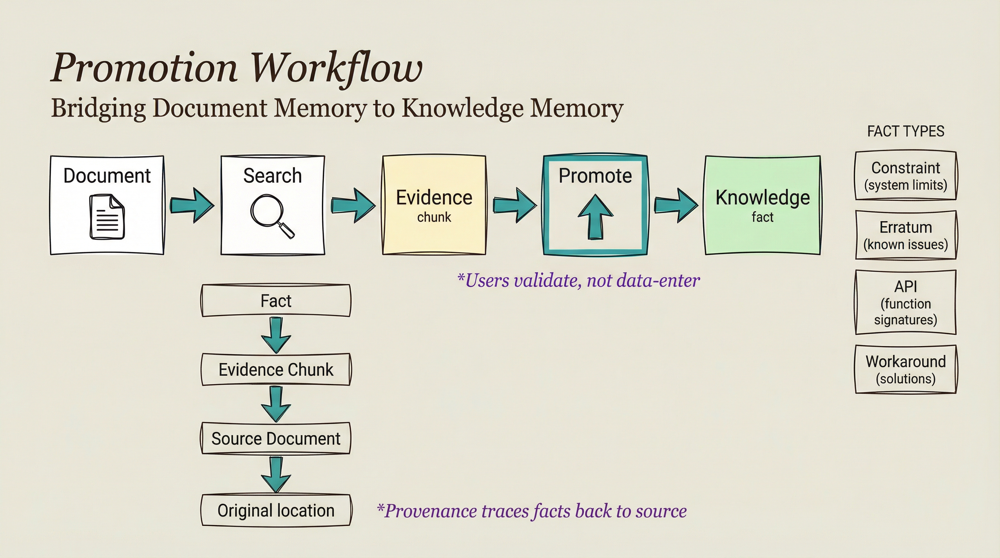

<!-- AI-FRIENDLY SUMMARY
System: LKAP Promotion Workflow
Purpose: Bridge Document Memory (RAG) to Knowledge Memory (Graph)

Workflow Steps:
1. Search Document Memory for evidence
2. Identify high-value chunks
3. Promote to Knowledge Memory with type
4. Trace provenance back to source

Fact Types:
- Constraint: System limits (max frequency)
- Erratum: Known issues (FIFO corruption)
- API: Function signatures (gpio_init)
- Workaround: Solutions (use DMA)
- BuildFlag: Compiler options (-DUSE_FIFO=0)
- ProtocolRule: Protocol limits (I2C 400kHz)
- Detection: Security rules (suspicious toggling)
- Indicator: IOC data (IP addresses)

MCP Tools:
- kg.promoteFromEvidence(evidenceId) - Promote from chunk
- kg.promoteFromQuery(query) - Search and promote in one step
- kg.getProvenance(factId) - Trace fact to source documents
-->

# Promotion Workflow

The promotion workflow bridges Document Memory (RAG) and Knowledge Memory (Graph), allowing high-value facts extracted from documents to become durable, typed knowledge with provenance.

## The Promotion Flow



```
Document → Search → Evidence → Promote → Knowledge
                    (chunk)            (fact)
```

1. **Search Document Memory** - Find relevant document chunks
2. **Review Evidence** - Chunks with citations and confidence scores
3. **Promote to Knowledge** - Extract structured fact with type
4. **Trace Provenance** - Facts link back to source documents

## Promotion Methods

### Promote from Evidence

Promote a specific chunk that contains valuable information:

```python
# Search and find relevant evidence
results = rag.search("SPI clock frequency limit")

# Promote the evidence to knowledge
kg.promoteFromEvidence(
    evidence_id="chunk-abc123",
    fact_type="Constraint",
    value="SPI max frequency is 80MHz"
)
```

### Promote from Query

Search and promote in one operation:

```python
# Search and promote in one step
kg.promoteFromQuery(
    query="maximum clock frequency",
    fact_type="Constraint"
)
```

### Trace Provenance

See where a fact came from:

```python
# Trace a fact back to its source documents
provenance = kg.getProvenance(fact_id="fact-456")

# Returns the chain:
# Fact → Evidence chunks → Source documents
```

## Fact Types

When promoting to knowledge, facts are typed for better organization and retrieval:

| Type | Description | Example |
|------|-------------|---------|
| `Constraint` | System limits | "max clock frequency is 120MHz" |
| `Erratum` | Known issues | "SPI FIFO corrupts above 80MHz" |
| `API` | Function signatures | `gpio_init(port, pin, mode)` |
| `Workaround` | Solutions | "Use DMA instead of FIFO" |
| `BuildFlag` | Compiler options | `-DUSE_SPI_FIFO=0` |
| `ProtocolRule` | Protocol limits | "I2C max frequency is 400kHz" |
| `Detection` | Security rules | "suspicious GPIO toggling" |
| `Indicator` | IOC data | "IP 192.168.1.100" |

## When to Promote

### Promote When:

- ✅ Information is verified and accurate
- ✅ You'll need to reference it frequently
- ✅ It affects design decisions
- ✅ It has relationships to other facts
- ✅ You want to trace its origin

### Don't Promote When:

- ❌ Information is speculative or uncertain
- ❌ It's only relevant for one query
- ❌ The document will be updated soon
- ❌ It duplicates existing knowledge

## Promotion Example

### Scenario: SPI Configuration

**Step 1: Search Document Memory**

```bash
bun run rag-cli.ts search "SPI clock configuration"
```

**Step 2: Review Evidence**

```
Chunk ID: chunk-spi-001
Source: STM32F4_Datasheet.pdf, page 456
Confidence: 0.92
Content: "The SPI maximum clock frequency is dependent on the APB
peripheral clock. For APB2 peripherals (SPI1), the maximum SPI
clock is fPCLK/2. With a 84MHz APB2 clock, this gives a maximum
SPI frequency of 42MHz."
```

**Step 3: Promote to Knowledge**

```python
kg.promoteFromEvidence(
    evidence_id="chunk-spi-001",
    fact_type="Constraint",
    value="SPI1 max frequency is 42MHz (APB2/2 at 84MHz)",
    related_entities=["SPI1", "APB2", "clock"]
)
```

**Step 4: Query Knowledge Later**

```python
# Fast, structured retrieval
kg.searchFacts("SPI frequency limit")
# Returns: Constraint: SPI1 max frequency is 42MHz
# Provenance: STM32F4_Datasheet.pdf, page 456
```

## Provenance Tracking

Every promoted fact maintains a provenance chain:

```
Fact (Knowledge Memory)
  └── Evidence Chunk (Document Memory)
        └── Source Document (File)
              └── Original location (page, section)
```

This allows you to:

- Verify facts against source documents
- Update knowledge when documents change
- Understand the origin of constraints
- Audit the knowledge base

## Conflict Detection

When promoting facts that contradict existing knowledge:

```python
# LKAP detects conflicts
result = kg.promoteFromEvidence(
    evidence_id="chunk-new",
    fact_type="Constraint",
    value="SPI max frequency is 80MHz"  # Conflicts with 42MHz
)

# Returns conflict warning:
# "Warning: This contradicts existing fact 'SPI1 max frequency is 42MHz'
#  (from STM32F4_Datasheet.pdf). Promote anyway?"
```

## Best Practices

1. **Promote verified facts only** - Validate before promoting
2. **Use specific fact types** - Helps with retrieval and organization
3. **Include relationships** - Link related entities for graph traversal
4. **Check for duplicates** - Search existing knowledge first
5. **Review provenance** - Ensure facts trace to authoritative sources

## Related Topics

- **[Two-Tier Memory Model](two-tier-model.md)** - Understanding the tiers
- **[Document Memory (RAG)](../rag/quickstart.md)** - Finding evidence
- **[Knowledge Memory (Graph)](../kg/quickstart.md)** - Managing knowledge
- **[LKAP Overview](index.md)** - Introduction to LKAP
