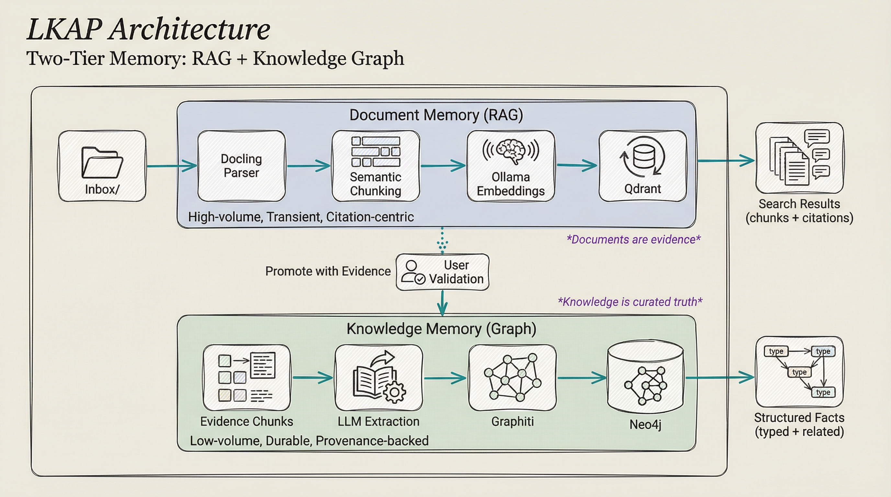
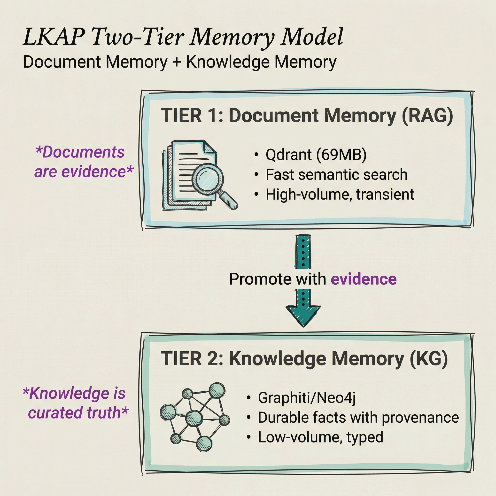

<!-- AI-FRIENDLY SUMMARY
System: LKAP Two-Tier Memory Model
Purpose: Guide users on when to use Document Memory vs Knowledge Memory

Tier 1 - Document Memory (RAG):
- Technology: Qdrant vector database
- Characteristics: High-volume, transient, citation-centric
- Use Cases: Exploring documents, finding evidence, semantic search

Tier 2 - Knowledge Memory (Graph):
- Technology: Graphiti/Neo4j knowledge graph
- Characteristics: Low-volume, durable, typed, provenance-backed
- Use Cases: Verified constraints, curated solutions, structured facts

Key Insight: Documents are evidence. Knowledge is curated truth.
- Promotion bridges the tiers
- Provenance traces facts back to documents
-->

# Two-Tier Memory Model

The LKAP (Local Knowledge Augmentation Platform) uses a two-tier memory architecture that separates transient document exploration from durable knowledge storage.

## Tier Comparison

| Aspect | Document Memory (RAG) | Knowledge Memory (Graph) |
|--------|----------------------|-------------------------|
| **Technology** | Qdrant vector database | Graphiti/Neo4j graph |
| **Storage** | Chunks with embeddings | Entities and relationships |
| **Volume** | High (thousands of docs) | Low (hundreds of facts) |
| **Persistence** | Transient (replace docs) | Durable (curated truth) |
| **Query Type** | Semantic similarity | Graph traversal |
| **Output** | Chunks with citations | Structured facts |
| **LLM Role** | Embeddings only | Entity/relationship extraction |

## When to Use Each Tier

### Use Document Memory (RAG) When:

- **Exploring new information** - "What does the datasheet say about GPIO?"
- **Finding citations** - "Find evidence for this design decision"
- **Searching broadly** - "What do our documents say about I2C?"
- **Working with full documents** - "Show me the relevant sections from the spec"
- **Uncertain about content** - "Is there anything about timeouts?"

### Use Knowledge Memory (Graph) When:

- **Retrieving verified facts** - "What's the max SPI clock frequency?"
- **Understanding relationships** - "What components depend on the RTC?"
- **Finding curated solutions** - "What workarounds exist for this erratum?"
- **Tracing provenance** - "Where did this constraint come from?"
- **Working with structured data** - "What APIs does the driver expose?"

## Decision Matrix

| Question Type | Recommended Tier | Example Query |
|--------------|------------------|---------------|
| Broad exploration | **Document Memory** | "Tell me about DMA" |
| Specific lookup | **Knowledge Memory** | "What's the DMA buffer size?" |
| Citation needed | **Document Memory** | "Show me the DMA documentation" |
| Verified fact | **Knowledge Memory** | "Is DMA supported on USART2?" |
| Relationship query | **Knowledge Memory** | "What peripherals use DMA?" |
| Source trace | **Knowledge Memory** | "Where is this documented?" |

## The Promotion Workflow

Documents contain evidence. Knowledge contains curated truth. The **promotion workflow** bridges them:

**Workflow Steps:**

1. **Search Document Memory** - Find relevant chunks with semantic search
2. **Identify High-Value Evidence** - Chunk contains important fact
3. **Promote to Knowledge** - Extract fact with type and provenance
4. **Query Knowledge Memory** - Retrieve structured facts when needed

➡️ **[Promotion Workflow](promotion-workflow.md)** - Full promotion guide

## Why Two Tiers?

### Why Not Just RAG?

- RAG returns chunks, not structured facts
- No relationship between concepts
- No type safety (everything is text)
- No provenance tracking
- No conflict detection

### Why Not Just Knowledge Graph?

- Requires manual entry for all facts
- LLM extraction is imperfect
- High-volume document exploration is slow
- No citation back to source documents
- Overhead for transient information

### Best of Both Worlds

- **RAG** handles high-volume document exploration
- **Knowledge Graph** stores curated, high-signal facts
- **Promotion** bridges the two with user validation
- **Provenance** traces facts back to evidence

## Architecture Diagram

## Related Topics

- **[LKAP Overview](index.md)** - Introduction to LKAP
- **[Promotion Workflow](promotion-workflow.md)** - How to promote facts
- **[Document Memory (RAG)](../rag/quickstart.md)** - RAG quickstart
- **[Knowledge Memory (Graph)](../kg/quickstart.md)** - Knowledge Graph quickstart
