# Prompt Caching Architecture

Feature: 006-gemini-prompt-caching

## Request Flow Diagram

```mermaid
flowchart TB
    subgraph Input["📝 LLM Request"]
        REQ[LLM API Call<br/>chat.completions.create]
    end

    subgraph Wrapper["🎯 CachingLLMClient Wrapper"]
        direction TB
        CHECK1["Check: is_caching_enabled?<br/>env: PROMPT_CACHE_ENABLED"]
        CHECK2["Check: is_gemini_model?<br/>google/gemini-*"]
        CHECK3["Check: is_cacheable_request?<br/>tokens ≥ 1024"]

        CHECK1 -->|false| PASS[Skip Caching]
        CHECK2 -->|false| PASS
        CHECK3 -->|false| PASS

        CHECK1 -->|true| FORMAT["format_messages_for_caching"]
        CHECK2 -->|true| FORMAT
        CHECK3 -->|true| FORMAT

        FORMAT --> CONVERT["convert_to_multipart<br/>text → content parts"]
        CONVERT --> MARKER["add_cache_control_marker<br/>last content part"]
        MARKER --> MODIFIED["Messages Modified<br/>cache_control added"]

        MODIFIED --> CALL["Wrapped LLM Client<br/>original create()"]
    end

    subgraph OpenRouter["🌐 OpenRouter API"]
        API[OpenRouter /chat/completions<br/>with cache_control]
    end

    subgraph Response["📦 Response Processing"]
        direction TB
        EXTRACT["_postprocess_response<br/>CacheMetrics.from_openrouter_response"]
        EXTRACT --> PARSE["Parse OpenRouter response<br/>- cache_read_tokens<br/>- cache_write_tokens<br/>- cached"]
        PARSE --> RECORD["Record Metrics<br/>SessionMetrics.record_*"]
        RECORD --> EXPORT[CacheMetricsExporter<br/>Prometheus metrics]
    end

    REQ --> Wrapper
    CALL --> API
    API --> Response
    MODIFIED --> CALL

    style Input fill:#e3f2fd,stroke:#01579b
    style Wrapper fill:#f3e5f5,stroke:#4a148c
    style OpenRouter fill:#fff3e0,stroke:#e65100
    style Response fill:#e8f5e9,stroke:#1b5e20
    style PASS fill:#c8e6c9,stroke:#2e7d32
    style FORMAT fill:#fff9c4,stroke:#f9a825
    style CONVERT fill:#e1f5fe,stroke:#0277bd
    style MARKER fill:#fce4ec,stroke:#c2185b
    style MODIFIED fill:#f3e5f5,stroke:#7b1fa2
    style CALL fill:#e8f5e9,stroke:#43a047
    style API fill:#ffebee,stroke:#c62828
    style EXTRACT fill:#e1f5fe,stroke:#01579b
    style PARSE fill:#e8f5e9,stroke:#43a047
    style RECORD fill:#f3e5f5,stroke:#6a1b9a
    style EXPORT fill:#fff3e0,stroke:#ff6f00
```



## Component Architecture

```mermaid
graph TB
    subgraph Environment["🔧 Environment Configuration"]
        ENV1["PROMPT_CACHE_ENABLED=false<br/>default: disabled"]
        ENV2["PROMPT_CACHE_METRICS_ENABLED=true<br/>default: enabled"]
        ENV3["PROMPT_CACHE_LOG_REQUESTS=false<br/>debug mode"]
    end

    subgraph Core["⚙️ Core Components"]
        direction TB
        MF["message_formatter.py<br/>format_messages_for_caching"]
        CM["cache_metrics.py<br/>CacheMetrics"]
        SM["session_metrics.py<br/>SessionMetrics"]
        ME["metrics_exporter.py<br/>CacheMetricsExporter"]
        CW["caching_wrapper.py<br/>wrap_openai_client_for_caching"]
    end

    subgraph Wrapper["🎯 CachingLLMClient"]
        direction LR
        PRE["_preprocess_request<br/>Add cache_control markers"]
        POST["_postprocess_response<br/>Extract cache metrics"]
    end

    subgraph LLM["🤖 Graphiti LLM Client"]
        CLIENT["LLMClient<br/>Graphiti's LLM wrapper"]
    end

    subgraph Metrics["📊 Observability"]
        PROM[Prometheus<br/>/metrics endpoint]
        OTEL[OpenTelemetry<br/>Optional export]
    end

    ENV1 --> MF
    ENV2 --> CM
    ENV3 --> MF

    CW --> CLIENT
    CLIENT --> Wrapper

    MF --> PRE
    CM --> POST
    SM --> POST
    ME --> EXPORT

    EXPORT --> PROM
    EXPORT --> OTEL

    style Environment fill:#e1f5fe,stroke:#01579b
    style Core fill:#f3e5f5,stroke:#4a148c
    style Wrapper fill:#fce4ec,stroke:#c2185b
    style LLM fill:#e8f5e9,stroke:#1b5e20
    style Metrics fill:#fff3e0,stroke:#ff6f00
```



## Cache Control Marker Format


## Decision Tree: When is Caching Applied?


## Metrics Flow

```mermaid
flowchart LR
    RESPONSE["OpenRouter Response"] --> EXTRACT[CacheMetrics.from_openrouter_response]

    EXTRACT --> PARSE1[Parse: cache_read_tokens]
    EXTRACT --> PARSE2[Parse: cache_write_tokens]
    EXTRACT --> PARSE3[Parse: cached status]
    EXTRACT --> PARSE4[Parse: prompt_tokens<br/>completion_tokens]

    PARSE1 --> CALC[Calculate savings:<br/>cached / (cached + uncached)]
    PARSE2 --> COST[Calculate cost savings<br/>using pricing tiers]
    PARSE4 --> HIT[Calculate hit rate:<br/>cached / total requests]

    CALC --> RECORD[SessionMetrics.record_*]
    COST --> RECORD
    HIT --> RECORD

    RECORD --> EXPORT[CacheMetricsExporter]
    EXPORT --> PROM[[Prometheus metrics<br/>graphiti_cache_*]]

    style RESPONSE fill:#e1f5fe,stroke:#01579b
    style EXTRACT fill:#f3e5f5,stroke:#4a148c
    style PARSE1 fill:#e8f5e9,stroke:#43a047
    style PARSE2 fill:#e8f5e9,stroke:#43a047
    style PARSE3 fill:#e8f5e9,stroke:#43a047
    style PARSE4 fill:#e8f5e9,stroke:#43a047
    style CALC fill:#fff3e0,stroke:#ef6c00
    style COST fill:#fce4ec,stroke:#c2185b
    style HIT fill:#c8e6c9,stroke:#2e7d32
    style RECORD fill:#f3e5f5,stroke:#6a1b9a
    style EXPORT fill:#fff3e0,stroke:#ff6f00
    style PROM fill:#ffebee,stroke:#c62828
```
