<!-- AI-FRIENDLY SUMMARY
System: Gemini Prompt Caching Implementation
Purpose: Reduce API costs via cached prompt prefixes with 90% discount on Gemini models
Key Components: CachingLLMClient, message_formatter, cache_metrics, caching_wrapper, metrics_exporter

Architecture Flow:
1. LLMClientFactory routes Gemini on OpenRouter to OpenAIGenericClient
2. wrap_openai_client_for_caching() patches chat.completions.create()
3. format_messages_for_caching() adds cache_control markers to last message
4. Response metrics extracted and recorded to Prometheus

Key Files (all in docker/patches/):
- factories.py: Client routing (lines 305-343)
- caching_wrapper.py: Monkey-patching wrapper
- message_formatter.py: Multipart format with cache_control
- cache_metrics.py: CacheMetrics dataclass with cost calculation
- session_metrics.py: Session-level aggregation
- metrics_exporter.py: Prometheus integration

Critical Design Decision:
- OpenRouter /responses endpoint rejects multipart format (caching fails)
- OpenAIGenericClient routes to /chat/completions (caching works + json_schema)

Pricing (per 1M tokens):
- gemini-2.0-flash: $0.10 input, $0.01 cached (90% off), $0.40 output
- gemini-2.5-flash: $0.30 input, $0.03 cached, $2.50 output
- gemini-2.5-pro: $1.25 input, $0.125 cached, $10.00 output

Configuration:
- MADEINOZ_KNOWLEDGE_PROMPT_CACHE_ENABLED=true
- MADEINOZ_KNOWLEDGE_PROMPT_CACHE_TTL=1h
- MADEINOZ_KNOWLEDGE_METRICS_PORT=9090
-->

# Cache Implementation Guide

This document describes how the Gemini prompt caching system works internally. For configuration and usage, see [Observability & Metrics](observability.md#prompt-caching-gemini).

## Architecture Overview

### Visual Architecture Diagrams

#### Request Flow Diagram

```mermaid
flowchart TB
    subgraph Input["📝 LLM Request"]
        REQ[LLM API Call<br/>chat.completions.create]
    end

    subgraph Wrapper["🎯 CachingLLMClient Wrapper"]
        direction TB
        CHECK1["Check: is_caching_enabled?<br/>env: PROMPT_CACHE_ENABLED"]
        CHECK2["Check: is_gemini_model?<br/>google/gemini-*"]
        CHECK3["Check: is_cacheable_request?<br/>tokens ≥ 1024"]

        CHECK1 -->|false| PASS[Skip Caching]
        CHECK2 -->|false| PASS
        CHECK3 -->|false| PASS

        CHECK1 -->|true| FORMAT["format_messages_for_caching"]
        CHECK2 -->|true| FORMAT
        CHECK3 -->|true| FORMAT

        FORMAT --> CONVERT["convert_to_multipart<br/>text → content parts"]
        CONVERT --> MARKER["add_cache_control_marker<br/>last content part"]
        MARKER --> MODIFIED["Messages Modified<br/>cache_control added"]

        MODIFIED --> CALL["Wrapped LLM Client<br/>original create()"]
    end

    subgraph OpenRouter["🌐 OpenRouter API"]
        API[OpenRouter /chat/completions<br/>with cache_control]
    end

    subgraph Response["📦 Response Processing"]
        direction TB
        EXTRACT["_postprocess_response<br/>CacheMetrics.from_openrouter_response"]
        EXTRACT --> PARSE["Parse OpenRouter response<br/>- cache_read_tokens<br/>- cache_write_tokens<br/>- cached"]
        PARSE --> RECORD["Record Metrics<br/>SessionMetrics.record_*"]
        RECORD --> EXPORT[CacheMetricsExporter<br/>Prometheus metrics]
    end

    REQ --> Wrapper
    CALL --> API
    API --> Response
    MODIFIED --> CALL

    style Input fill:#e3f2fd,stroke:#01579b
    style Wrapper fill:#f3e5f5,stroke:#4a148c
    style OpenRouter fill:#fff3e0,stroke:#e65100
    style Response fill:#e8f5e9,stroke:#1b5e20
    style PASS fill:#c8e6c9,stroke:#2e7d32
    style FORMAT fill:#fff9c4,stroke:#f9a825
    style CONVERT fill:#e1f5fe,stroke:#0277bd
    style MARKER fill:#fce4ec,stroke:#c2185b
    style MODIFIED fill:#f3e5f5,stroke:#7b1fa2
    style CALL fill:#e8f5e9,stroke:#43a047
    style API fill:#ffebee,stroke:#c62828
    style EXTRACT fill:#e1f5fe,stroke:#01579b
    style PARSE fill:#e8f5e9,stroke:#43a047
    style RECORD fill:#f3e5f5,stroke:#6a1b9a
    style EXPORT fill:#fff3e0,stroke:#ff6f00
```



#### Component Architecture

```mermaid
graph TB
    subgraph Environment["🔧 Environment Configuration"]
        ENV1["PROMPT_CACHE_ENABLED=false<br/>default: disabled"]
        ENV2["PROMPT_CACHE_METRICS_ENABLED=true<br/>default: enabled"]
        ENV3["PROMPT_CACHE_LOG_REQUESTS=false<br/>debug mode"]
    end

    subgraph Core["⚙️ Core Components"]
        direction TB
        MF["message_formatter.py<br/>format_messages_for_caching"]
        CM["cache_metrics.py<br/>CacheMetrics"]
        SM["session_metrics.py<br/>SessionMetrics"]
        ME["metrics_exporter.py<br/>CacheMetricsExporter"]
        CW["caching_wrapper.py<br/>wrap_openai_client_for_caching"]
    end

    subgraph Wrapper["🎯 CachingLLMClient"]
        direction LR
        PRE["_preprocess_request<br/>Add cache_control markers"]
        POST["_postprocess_response<br/>Extract cache metrics"]
    end

    subgraph LLM["🤖 Graphiti LLM Client"]
        CLIENT["LLMClient<br/>Graphiti's LLM wrapper"]
    end

    subgraph Metrics["📊 Observability"]
        PROM[Prometheus<br/>/metrics endpoint]
        OTEL[OpenTelemetry<br/>Optional export]
    end

    ENV1 --> MF
    ENV2 --> CM
    ENV3 --> MF

    CW --> CLIENT
    CLIENT --> Wrapper

    MF --> PRE
    CM --> POST
    SM --> POST
    ME --> EXPORT

    EXPORT --> PROM
    EXPORT --> OTEL

    style Environment fill:#e1f5fe,stroke:#01579b
    style Core fill:#f3e5f5,stroke:#4a148c
    style Wrapper fill:#fce4ec,stroke:#c2185b
    style LLM fill:#e8f5e9,stroke:#1b5e20
    style Metrics fill:#fff3e0,stroke:#ff6f00
```



#### Decision Tree: When is Caching Applied?

```mermaid
flowchart TD
    START[LLM Request] --> CHECK_ENV{Caching enabled?}

    CHECK_ENV -->|false| SKIP[No caching]
    CHECK_ENV -->|true| CHECK_MODEL{Is Gemini model?}

    CHECK_MODEL -->|no| SKIP
    CHECK_MODEL -->|yes| CHECK_TOKENS{Request ≥ 1024 tokens?}

    CHECK_TOKENS -->|no| SKIP
    CHECK_TOKENS -->|yes| APPLY_CACHE[Apply caching wrappers]

    APPLY_CACHE --> SUCCESS[Caching enabled<br/>cache_control markers added]
    SKIP --> DIRECT[Bypass caching<br/>direct API call]

    style START fill:#e3f2fd,stroke:#01579b
    style SUCCESS fill:#c8e6c9,stroke:#2e7d32
    style SKIP fill:#ffcdd2,stroke:#c62828
    style DIRECT fill:#fff3e0,stroke:#ef6c00
```



#### Metrics Flow

```mermaid
flowchart LR
    RESPONSE["OpenRouter Response"] --> EXTRACT[CacheMetrics.from_openrouter_response]

    EXTRACT --> PARSE1[Parse: cache_read_tokens]
    EXTRACT --> PARSE2[Parse: cache_write_tokens]
    EXTRACT --> PARSE3[Parse: cached status]
    EXTRACT --> PARSE4[Parse: prompt_tokens<br/>completion_tokens]

    PARSE1 --> CALC[Calculate savings:<br/>cached / (cached + uncached)]
    PARSE2 --> COST[Calculate cost savings<br/>using pricing tiers]
    PARSE4 --> HIT[Calculate hit rate:<br/>cached / total requests]

    CALC --> RECORD[SessionMetrics.record_*]
    COST --> RECORD
    HIT --> RECORD

    RECORD --> EXPORT[CacheMetricsExporter]
    EXPORT --> PROM[[Prometheus metrics<br/>graphiti_cache_*]]

    style RESPONSE fill:#e1f5fe,stroke:#01579b
    style EXTRACT fill:#f3e5f5,stroke:#4a148c
    style PARSE1 fill:#e8f5e9,stroke:#43a047
    style PARSE2 fill:#e8f5e9,stroke:#43a047
    style PARSE3 fill:#e8f5e9,stroke:#43a047
    style PARSE4 fill:#e8f5e9,stroke:#43a047
    style CALC fill:#fff3e0,stroke:#ef6c00
    style COST fill:#fce4ec,stroke:#c2185b
    style HIT fill:#c8e6c9,stroke:#2e7d32
    style RECORD fill:#f3e5f5,stroke:#6a1b9a
    style EXPORT fill:#fff3e0,stroke:#ff6f00
    style PROM fill:#ffebee,stroke:#c62828
```

### Request Flow (Textual)

```
LLM Request
    ↓
LLMClientFactory.create()
    ↓
[Route Decision]
├─ Gemini on OpenRouter → OpenAIGenericClient
├─ Local endpoints (Ollama) → OpenAIGenericClient
└─ Other providers → OpenAIClient
    ↓
wrap_openai_client_for_caching()
    ↓
[Preprocessing]
├─ Format messages with cache_control markers
├─ Add to last message only
└─ Convert strings to multipart format
    ↓
OpenAI /chat/completions API call
    ↓
[Postprocessing]
├─ Extract cache metrics from response
├─ Calculate token/cost savings
├─ Record to session metrics
└─ Export to Prometheus
    ↓
Response with Cache Metadata
```

### File Architecture

All cache implementation files live in `docker/patches/` following Constitution Principle VII (Language Separation): Python code in `docker/`, TypeScript code in `src/`.

| File | Purpose | Key Exports |
|------|---------|-------------|
| `factories.py` | Client routing logic | `LLMClientFactory.create()` |
| `caching_wrapper.py` | Patches OpenAI client | `wrap_openai_client_for_caching()` |
| `message_formatter.py` | Adds cache_control markers | `format_messages_for_caching()` |
| `cache_metrics.py` | Per-request metrics | `CacheMetrics`, `PricingTier` |
| `session_metrics.py` | Session aggregation | `SessionMetrics` |
| `metrics_exporter.py` | Prometheus export | `CacheMetricsExporter` |
| `caching_llm_client.py` | Wrapper class | `CachingLLMClient` |

## Client Routing

The critical design decision in this implementation: **Gemini models on OpenRouter must use OpenAIGenericClient** to route requests through `/chat/completions` instead of `/responses`.

**Location**: `docker/patches/factories.py` (lines 305-343)

```python
# Simplified routing logic
if _is_gemini_model(config.model) and 'openrouter' in provider_name.lower():
    # Use OpenAIGenericClient (routes to /chat/completions)
    client = OpenAIGenericClient(config=llm_config)
    if _caching_wrapper_available:
        client = wrap_openai_client_for_caching(client, config.model)
    return client
```

### Why This Matters

| Endpoint | Multipart Format | Caching Works | Structured Output |
|----------|------------------|---------------|-------------------|
| `/responses` | Rejected | No | Yes |
| `/chat/completions` | Accepted | Yes | Yes (json_schema) |

The `/responses` endpoint returns `"expected string, received array"` when it receives multipart messages with `cache_control` markers. The `/chat/completions` endpoint accepts both multipart format AND `json_schema` for structured outputs.

## Message Formatting

**Location**: `docker/patches/message_formatter.py`

The formatter converts messages to multipart format and adds `cache_control` markers to the **last message only**.

### Transformation Example

**Input** (standard format):

```json
{"role": "system", "content": "You are an AI assistant..."}
```

**Output** (multipart with cache_control):

```json
{
    "role": "system",
    "content": [
        {
            "type": "text",
            "text": "You are an AI assistant...",
            "cache_control": {"type": "ephemeral", "ttl": "1h"}
        }
    ]
}
```

### Why Mark Only the Last Message?

The cache_control marker tells Gemini "everything up to and including this point should be cached." By marking the last message:

1. System prompts and context (earlier messages) become part of the cached prefix
2. First request creates the cache (pays full price)
3. Subsequent requests with the same prefix get 90% discount on cached tokens

### Processing Functions

| Function | Purpose |
|----------|---------|
| `is_caching_enabled()` | Checks `MADEINOZ_KNOWLEDGE_PROMPT_CACHE_ENABLED` |
| `is_gemini_model(model)` | Pattern matches "google/gemini" |
| `is_cacheable_request(messages)` | Heuristic: minimum ~1024 tokens |
| `convert_to_multipart(message)` | Converts string content to array format |
| `add_cache_control_marker(message)` | Adds `{"type": "ephemeral", "ttl": "..."}` |
| `format_messages_for_caching(messages, model)` | Main entry point |

## Metrics Data Models

### CacheMetrics (Per-Request)

**Location**: `docker/patches/cache_metrics.py`

```python
@dataclass
class CacheMetrics:
    cache_hit: bool           # Was cache used?
    cached_tokens: int        # Tokens served from cache
    prompt_tokens: int        # Total input tokens
    completion_tokens: int    # Output tokens
    tokens_saved: int         # Alias for cached_tokens
    cost_without_cache: float # Hypothetical cost (USD)
    actual_cost: float        # Real cost after discount
    cost_saved: float         # Dollar savings
    savings_percent: float    # Reduction percentage (0-100)
    model: str                # Model identifier
```

### Cost Calculation

```python
# Cost without cache (all tokens at full rate)
cost_without_cache = (prompt_tokens * input_rate) + (completion_tokens * output_rate)

# Actual cost (cached tokens at 90% discount)
uncached_tokens = prompt_tokens - cached_tokens
actual_cost = (uncached_tokens * input_rate) + \
              (cached_tokens * cached_input_rate) + \
              (completion_tokens * output_rate)

# Savings
cost_saved = cost_without_cache - actual_cost
```

### Pricing Tiers

| Model | Input (per 1M) | Cached (90% off) | Output (per 1M) |
|-------|----------------|------------------|-----------------|
| gemini-2.0-flash-001 | $0.10 | $0.01 | $0.40 |
| gemini-2.5-flash | $0.30 | $0.03 | $2.50 |
| gemini-2.5-pro | $1.25 | $0.125 | $10.00 |

### SessionMetrics (Aggregated)

**Location**: `docker/patches/session_metrics.py`

Aggregates metrics across all requests in a session:

| Property | Type | Description |
|----------|------|-------------|
| `total_requests` | int | Total API calls |
| `cache_hits` | int | Requests with cache_hit=true |
| `cache_misses` | int | Requests with cache_hit=false |
| `total_cached_tokens` | int | Sum of all cached_tokens |
| `total_cost_without_cache` | float | Cumulative hypothetical cost |
| `total_actual_cost` | float | Cumulative real cost |
| `total_cost_saved` | float | Total savings |
| `cache_hit_rate` | float | Calculated percentage (0-100) |
| `overall_savings_percent` | float | Overall cost reduction % |

## The Caching Wrapper

**Location**: `docker/patches/caching_wrapper.py`

The wrapper monkey-patches `chat.completions.create()` to intercept requests and responses.

### Request Processing

```python
async def create_with_caching(*args, **kwargs):
    # 1. PREPROCESSING: Format messages with cache_control
    if 'messages' in kwargs:
        kwargs['messages'] = format_messages_for_caching(
            kwargs['messages'], model
        )

    # 2. TIMING: Measure request duration
    start_time = time.monotonic()
    response = await original_create(*args, **kwargs)
    duration = time.monotonic() - start_time

    # 3. POSTPROCESSING: Extract metrics
    extract_and_record_metrics(response)

    return response
```

### Response Metric Extraction

The wrapper handles multiple response formats:

| Format | Source | Fields |
|--------|--------|--------|
| OpenRouter (root-level) | `response.native_tokens_cached` | `native_tokens_cached`, `tokens_prompt`, `tokens_completion` |
| OpenAI (usage object) | `response.usage.cached_tokens` | `cached_tokens`, `prompt_tokens`, `completion_tokens` |

### Known Limitation: responses.parse()

The `responses.parse()` endpoint does **not** support multipart format:

```
Error: expected string, received array
```

**Solution**: Caching is automatically skipped for `responses.parse()` calls. Only `chat.completions.create()` supports caching.

## Prometheus Integration

**Location**: `docker/patches/metrics_exporter.py`

### Initialization

The metrics exporter is initialized in `graphiti_mcp_server.py`:

```python
if _metrics_exporter_available:
    metrics_port = int(os.getenv("MADEINOZ_KNOWLEDGE_METRICS_PORT", "9090"))
    metrics_enabled = os.getenv("MADEINOZ_KNOWLEDGE_PROMPT_CACHE_METRICS_ENABLED", "true")
    initialize_metrics_exporter(enabled=metrics_enabled, port=metrics_port)
```

### Exposed Metrics

#### Counters (Cumulative)

| Metric | Labels | Description |
|--------|--------|-------------|
| `graphiti_cache_hits_total` | model | Cache hit count |
| `graphiti_cache_misses_total` | model | Cache miss count |
| `graphiti_cache_tokens_saved_total` | model | Total cached tokens |
| `graphiti_cache_cost_saved_total` | model | Total $ saved |
| `graphiti_prompt_tokens_total` | model | Input tokens used |
| `graphiti_completion_tokens_total` | model | Output tokens used |
| `graphiti_api_cost_total` | model | Total API cost |

#### Gauges (Current Value)

| Metric | Labels | Description |
|--------|--------|-------------|
| `graphiti_cache_hit_rate` | model | Current hit rate % |
| `graphiti_cache_enabled` | none | 1=enabled, 0=disabled |

#### Histograms (Distributions)

| Metric | Description |
|--------|-------------|
| `graphiti_prompt_tokens_per_request` | Input token distribution |
| `graphiti_api_cost_per_request` | Cost per request |
| `graphiti_llm_request_duration_seconds` | Response latency |

### Example Output

```prometheus
# Cache hit rate gauge
graphiti_cache_hit_rate{model="google/gemini-2.0-flash-001"} 75.77

# Cache hits counter
graphiti_cache_hits_total{model="google/gemini-2.0-flash-001"} 1523

# Cost savings counter
graphiti_cache_cost_saved_total{model="google/gemini-2.0-flash-001"} 0.7584
```

## Configuration Reference

| Variable | Default | Description |
|----------|---------|-------------|
| `MADEINOZ_KNOWLEDGE_PROMPT_CACHE_ENABLED` | `false` | Enable/disable caching |
| `MADEINOZ_KNOWLEDGE_PROMPT_CACHE_TTL` | `1h` | Cache TTL (`5m` or `1h`) |
| `MADEINOZ_KNOWLEDGE_METRICS_PORT` | `9090` | Prometheus metrics port |
| `MADEINOZ_KNOWLEDGE_PROMPT_CACHE_METRICS_ENABLED` | `true` | Enable metrics export |
| `MADEINOZ_KNOWLEDGE_PROMPT_CACHE_LOG_REQUESTS` | `false` | Debug logging |

## Testing

Test files follow Constitution Principle VII (Language Separation):

| Test File | Location | Purpose |
|-----------|----------|---------|
| `test_cache_metrics.py` | `docker/tests/unit/` | Cache metrics extraction |
| `test_session_metrics.py` | `docker/tests/unit/` | Session aggregation |
| `test_caching_e2e.py` | `docker/tests/integration/` | End-to-end workflow |
| `test_metrics_endpoint.py` | `docker/tests/integration/` | Prometheus endpoint |

### Success Criteria

| Metric | Target |
|--------|--------|
| Token reduction from cache | 40%+ |
| Cache hit rate (after warmup) | 60%+ |
| Response time improvement | 25%+ faster |

## Quick Reference

### Dependency Graph

```
factories.py
    → wrap_openai_client_for_caching() [caching_wrapper.py]
        → format_messages_for_caching() [message_formatter.py]
        → extract_and_record_metrics()
            → CacheMetrics.from_openrouter_response() [cache_metrics.py]
            → SessionMetrics.record_request() [session_metrics.py]
            → metrics_exporter.record_*() [metrics_exporter.py]
```

### Key Design Decisions

| Decision | Rationale |
|----------|-----------|
| OpenAIGenericClient routing | `/responses` rejects multipart; `/chat/completions` supports both |
| Mark only last message | System prompts become cached prefix |
| Session-level metrics | Track cumulative effectiveness |
| Prometheus + OpenTelemetry | Standard observability format |
| 90% cached token discount | Reflects Gemini's actual pricing |
| 1-hour default TTL | Balance hit rate vs freshness |
