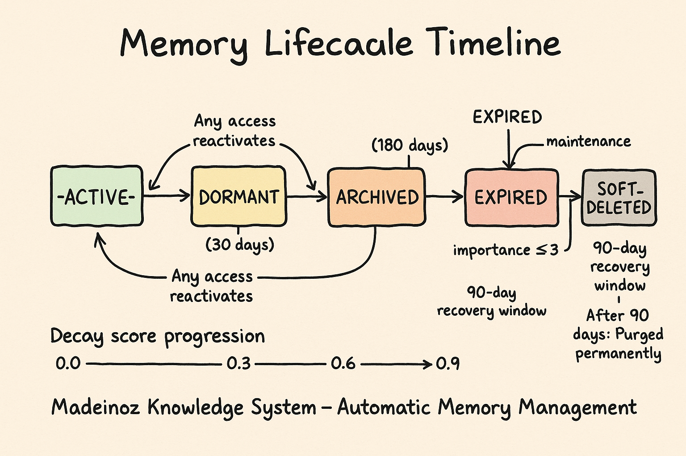
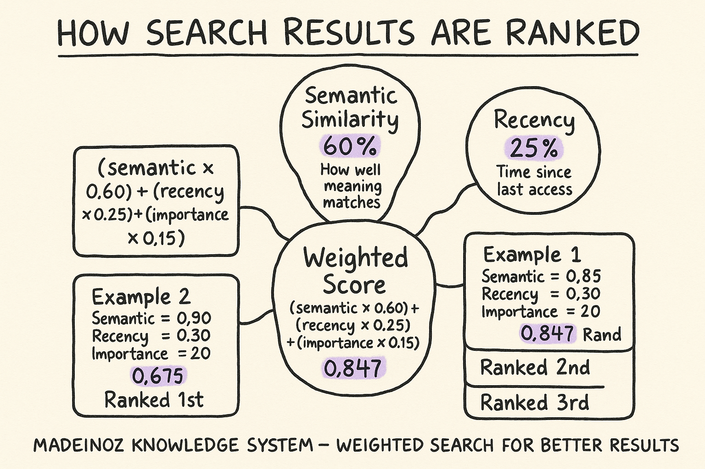

<!-- AI-FRIENDLY SUMMARY
System: Madeinoz Knowledge System Memory Decay (Feature 009)
Purpose: Automatic memory prioritization, decay scoring, and lifecycle management
Key Components: Importance classification (1-5), Stability classification (1-5), Decay scoring (0.0-1.0), Lifecycle states (5 states), Weighted search, Maintenance service

Key Commands:
- curl http://localhost:8000/health | jq '.maintenance': Check maintenance status
- curl http://localhost:8000/health | jq '.memory_counts.by_state': Check lifecycle state distribution
- curl http://localhost:9091/metrics | grep knowledge_decay: View decay metrics

Configuration: config/decay-config.yaml (copied into container at build time)
Environment Prefix: MADEINOZ_KNOWLEDGE_*
Metrics Port: 9091 (dev), 9090 (prod)
Grafana Dashboard: Memory Decay (http://localhost:3002/d/memory-decay-dashboard)

Importance Levels: TRIVIAL (1), LOW (2), MODERATE (3), HIGH (4), CORE (5)
Stability Levels: VOLATILE (1), LOW (2), MODERATE (3), HIGH (4), PERMANENT (5)
Lifecycle States: ACTIVE, DORMANT (30+ days), ARCHIVED (90+ days), EXPIRED (180+ days), SOFT_DELETED (90-day retention)

Permanent Memory Rule: importance >= 4 AND stability >= 4 = never decays

Search Weights (default): semantic 60%, recency 25%, importance 15%

Maintenance Schedule: Every 24 hours (configurable via schedule_interval_hours)
Batch Size: 500 memories per maintenance run
Max Duration: 10 minutes per maintenance run

Decay Thresholds: DORMANT (30 days, score >= 0.3), ARCHIVED (90 days, score >= 0.6), EXPIRED (180 days, score >= 0.9, importance <= 3)
-->

# Memory Decay & Lifecycle Management

The Madeinoz Knowledge System includes an intelligent memory decay and lifecycle management system (Feature 009) that automatically prioritizes important memories, allows stale information to fade, and maintains sustainable graph growth over time.

## Overview

!!! info "Why Memory Decay Matters"
    Without decay management, your knowledge graph would accumulate every piece of information indefinitely, leading to:

    - **Bloated search results** - Trivial temporary information crowds out important knowledge
    - **Degraded performance** - More memories = slower queries and higher costs
    - **Stale data prominence** - Old, irrelevant memories appear alongside current information

    Memory decay solves this by automatically:

    - **Prioritizing important memories** in search results
    - **Fading unused, unimportant information** over time
    - **Archiving or deleting stale memories** to maintain graph health

## Key Concepts

### Importance Classification (1-5)

Every memory is assigned an **importance score** at ingestion time:

| Level | Name | Description | Examples |
|-------|------|-------------|----------|
| **5** | CORE | Fundamental to your identity or work | "I am allergic to shellfish", "My name is Stephen" |
| **4** | HIGH | Important to your current projects | "Working on payment feature this sprint", "Team uses TypeScript" |
| **3** | MODERATE | General knowledge, default | "Prefers dark mode", "Uses VS Code" |
| **2** | LOW | Useful but replaceable | "Read an article about Rust", "Tried a new library" |
| **1** | TRIVIAL | Ephemeral, can forget quickly | "Weather was nice today", "Had coffee at 9am" |


#### How it works

- The LLM analyzes the content and context during ingestion
- Default fallback: `3` (MODERATE) if LLM unavailable
- Higher importance = slower decay, prioritized in search

### Stability Classification (1-5)

Every memory is assigned a **stability score** predicting how likely it is to change:

| Level | Name | Description | Examples |
|-------|------|-------------|----------|
| **5** | PERMANENT | Never changes | "Birth date", "Education history" |
| **4** | HIGH | Rarely changes (months/years) | "Home address", "Job title" |
| **3** | MODERATE | Changes occasionally (weeks/months) | "Current project", "Team structure" |
| **2** | LOW | Changes regularly (days/weeks) | "Current sprint goals", "Reading list" |
| **1** | VOLATILE | Changes frequently (hours/days) | "Today's meeting notes", "Current task" |

#### How it works

- The LLM predicts volatility based on content type
- Default fallback: `3` (MODERATE) if LLM unavailable
- Higher stability = longer half-life, slower decay

### Decay Score (0.0-1.0)

The **decay score** represents how "stale" a memory has become:

- **0.0** = Fresh (recently accessed or created)
- **0.5** = Somewhat stale
- **1.0** = Fully decayed (should be archived or deleted)

#### Calculation

- Uses exponential half-life formula adjusted by stability
- More time since last access = higher decay score
- Higher importance = slower decay accumulation
- Higher stability = slower decay accumulation
- Accessing a memory resets decay to 0.0

### Lifecycle States

Memories transition through **5 lifecycle states** based on decay score and time inactive:



| State | Description | Search Behavior | Recovery |
|-------|-------------|-----------------|----------|
| **ACTIVE** | Recently accessed, full relevance | Ranked normally | N/A |
| **DORMANT** | Not accessed for 30+ days | Lower priority | Auto-reactivates on access |
| **ARCHIVED** | Not accessed for 90+ days | Much lower priority | Auto-reactivates on access |
| **EXPIRED** | Marked for deletion | Excluded from search | Manual recovery only |
| **SOFT_DELETED** | Deleted, 90-day recovery window | Hidden from search | Admin recovery within 90 days |

**Permanent memories exempt:** Importance ≥4 AND Stability ≥4 = PERMANENT (never decays)

## Weighted Search Results

!!! success "Primary Benefit"
    The main user-facing benefit of memory decay is **better search results**.

    Without decay: Results ranked purely by semantic similarity
    With decay: Results ranked by **semantic relevance (60%) + recency (25%) + importance (15%)**



### How Search Ranking Works

When you search for knowledge, results are scored using:

```
weighted_score = (semantic_similarity × 0.60) + (recency_boost × 0.25) + (importance × 0.15)
```

**Example:**

| Memory | Semantic | Recency | Importance | Weighted Score | Rank |
|--------|----------|---------|------------|----------------|------|
| "Project architecture" | 0.85 | 0.90 | 0.80 (HIGH) | **0.8475** | 1st |
| "Random blog post" | 0.90 | 0.30 | 0.20 (LOW) | **0.6200** | 2nd |
| "Today's weather" | 0.95 | 0.95 | 0.20 (TRIVIAL) | **0.7150** | 3rd |

Even though "Today's weather" has the highest semantic similarity (0.95), the "Project architecture" memory ranks first because it combines good semantic match with high importance and reasonable recency.

### Configuring Search Weights

Edit `config/decay-config.yaml`:

```yaml
decay:
  weights:
    semantic: 0.60    # Vector similarity weight
    recency: 0.25     # Temporal freshness weight
    importance: 0.15  # Importance score weight
```

**Note:** Weights must sum to 1.0. Adjust based on your priorities:

- Want recent stuff more? Increase `recency`
- Only care about accuracy? Increase `semantic`
- Always show important stuff? Increase `importance`

## Lifecycle Management

### State Transitions

Memories automatically transition states based on:

1. **Time inactive** (days since last access)
2. **Decay score** (0.0-1.0 scale)
3. **Importance threshold** (some states exempt important memories)

**Default thresholds:**

| Transition | Criteria |
|------------|----------|
| ACTIVE → DORMANT | 30 days inactive AND decay_score ≥ 0.3 |
| DORMANT → ARCHIVED | 90 days inactive AND decay_score ≥ 0.6 |
| ARCHIVED → EXPIRED | 180 days inactive AND decay_score ≥ 0.9 AND importance ≤ 3 |
| EXPIRED → SOFT_DELETED | Maintenance runs (automatic) |

**Reactivation:** Any memory access (search result, explicit retrieval) immediately transitions DORMANT or ARCHIVED memories back to ACTIVE.

### Permanent Memory Protection


Memories with **importance ≥4 AND stability ≥4** are classified as **PERMANENT**:

- Never accumulate decay (decay_score always 0.0)
- Never transition lifecycle states (always ACTIVE)
- Exempt from archival and deletion
- Prioritized in search results

#### Use cases

- Core identity information (name, birthdate)
- Critical facts (allergies, medical conditions)
- Permanent career details (profession, degree)

## Maintenance Operations

### Automatic Maintenance

The system runs **automatic maintenance every 24 hours** (configurable):

#### What it does

1. Recalculates decay scores for all memories
2. Transitions memories between lifecycle states
3. Soft-deletes expired memories (with 90-day retention)
4. Generates health metrics for Grafana

#### How to verify

```bash
# Check last maintenance run
curl http://localhost:8000/health | jq '.maintenance.last_run_at'

# View maintenance metrics
curl http://localhost:9091/metrics | grep knowledge_decay_maintenance
```

### Manual Maintenance

Trigger maintenance on demand:

```bash
# Via MCP tool (if exposed)
{
  "name": "run_maintenance",
  "arguments": {
    "max_duration_minutes": 10
  }
}
```

#### What to expect

- Processes memories in batches of 500
- Maximum runtime: 10 minutes (configurable)
- Updates Prometheus metrics throughout

## Configuration

### Configuration File

**Location:** `config/decay-config.yaml`

This file is copied into the Docker container at build time. Rebuild after changes:

```bash
# 1. Edit configuration
nano config/decay-config.yaml

# 2. Rebuild Docker image
docker build -f docker/Dockerfile -t madeinoz-knowledge-system:local .

# 3. Restart containers
bun run server-cli stop
bun run server-cli start --dev
```

### Key Configuration Sections

#### Decay Thresholds

```yaml
decay:
  thresholds:
    dormant:
      days: 30           # Days before ACTIVE → DORMANT
      decay_score: 0.3   # Decay score threshold
    archived:
      days: 90           # Days before DORMANT → ARCHIVED
      decay_score: 0.6   # Decay score threshold
    expired:
      days: 180          # Days before ARCHIVED → EXPIRED
      decay_score: 0.9   # Decay score threshold
      max_importance: 3  # Only expire if importance ≤ 3
```

#### Maintenance Schedule

```yaml
decay:
  maintenance:
    batch_size: 500             # Memories per batch
    max_duration_minutes: 10    # Maximum runtime
    schedule_interval_hours: 24 # Hours between automatic runs (0 = disabled)
```

Set to `0` to disable automatic maintenance (run manually only).

#### Search Weights

```yaml
decay:
  weights:
    semantic: 0.60    # Vector similarity
    recency: 0.25     # Temporal freshness
    importance: 0.15  # Importance score
```

## Monitoring & Observability

### Grafana Dashboard

The **Memory Decay** dashboard provides real-time visibility:

**Key Panels:**

1. **Total Memories** - Current memory count (excluding soft-deleted)
2. **Avg Decay Score** - Average decay across all memories (0.0 = healthy)
3. **Maintenance** - Shows "Completed" if maintenance ran successfully
4. **Total Purged** - Count of soft-deleted memories permanently removed
5. **By State** - Pie chart showing distribution across lifecycle states
6. **Avg Scores** - Average importance and stability scores
7. **By Importance** - Distribution across importance levels (TRIVIAL → CORE)

**Access:** `http://localhost:3002/d/memory-decay-dashboard` (dev)

### Health Endpoint

```bash
curl http://localhost:8000/health | jq
```

**Response:**

```json
{
  "status": "healthy",
  "maintenance": {
    "last_run_at": "2026-01-29T14:00:00Z",
    "last_duration_seconds": 45.2,
    "last_run_status": "success"
  },
  "memory_counts": {
    "total": 65,
    "by_state": {
      "ACTIVE": 65,
      "DORMANT": 0,
      "ARCHIVED": 0,
      "EXPIRED": 0
    }
  },
  "decay_metrics": {
    "avg_decay_score": 0.0,
    "avg_importance": 3.0,
    "avg_stability": 3.0
  }
}
```

## Troubleshooting

### Memories Decaying Too Fast

**Symptom:** Important memories becoming DORMANT or ARCHIVED quickly

**Solutions:**

1. **Check importance classification:**
   ```bash
   # View memory attributes via Neo4j Browser
   # http://localhost:7474
   MATCH (n:Entity)
   WHERE n.name CONTAINS "important-thing"
   RETURN n.name, n.attributes.importance, n.attributes.stability
   ```

2. **Adjust decay thresholds:**
   ```yaml
   # config/decay-config.yaml
   decay:
     base_half_life_days: 60  # Increase for slower decay
   ```

3. **Mark important memories as permanent:**
   - Edit memory and set importance=4, stability=4
   - Or rebuild graph with corrected importance

### Maintenance Not Running

**Symptom:** Grafana shows "Never" for Maintenance status

**Solutions:**

1. **Check schedule configuration:**
   ```yaml
   # config/decay-config.yaml
   decay:
     maintenance:
       schedule_interval_hours: 24  # Ensure not 0
   ```

2. **Check MCP server logs:**
   ```bash
   bun run server-cli logs --mcp | grep -i maintenance
   ```

3. **Verify maintenance code loaded:**
   ```bash
   docker exec madeinoz-knowledge-graph-mcp-dev ls -la /app/mcp/src/utils/maintenance_service.py
   ```

### Poor Search Results

**Symptom:** Trivial recent results outranking important older ones

**Solutions:**

1. **Adjust search weights:**
   ```yaml
   # config/decay-config.yaml
   decay:
     weights:
       semantic: 0.50    # Decrease semantic weight
       recency: 0.20     # Decrease recency weight
       importance: 0.30  # Increase importance weight
   ```

2. **Ensure importance classification is working:**
   ```bash
   # Check classification metrics
   curl http://localhost:9091/metrics | grep knowledge_classification
   ```

3. **Verify decay scores are being calculated:**
   ```bash
   curl http://localhost:9091/metrics | grep knowledge_decay_score_avg
   ```

## Advanced Topics

### Soft-Delete Recovery

Memories in `SOFT_DELETED` state can be recovered within 90 days:

```cypher
# Via Neo4j Browser
MATCH (n:Entity)
WHERE n.attributes.soft_deleted_at IS NOT NULL
  AND datetime() > datetime(n.attributes.soft_deleted_at) + duration('P90D')
RETURN n.name, n.attributes.soft_deleted_at
```

#### Recovery process

1. Identify memory to recover via query above
2. Clear soft_deleted_at attribute
3. Set lifecycle_state to "ARCHIVED"
4. Memory will be re-evaluated on next maintenance

### Bulk Import Considerations

When importing large amounts of data:

#### Classification behavior

- All memories start with default importance=3, stability=3
- Background LLM classification refines scores asynchronously
- First maintenance run after import will properly classify everything

#### Recommendations
1. Import in batches of 1000-5000 memories
2. Wait for maintenance to run between batches
3. Monitor classification metrics for success rate
4. Adjust defaults if LLM unavailable:
   ```yaml
   # config/decay-config.yaml
   classification:
     default_importance: 3  # Set based on your data
     default_stability: 3
   ```

### Custom Decay Curves

For specialized use cases, you can implement custom decay logic:

#### Half-life adjustment

- Base half-life: 30 days (configurable)
- Stability factor: Multiplier based on stability level

**Stability multiplier examples:**

The stability level adjusts the base half-life:

- Stability 1 (VOLATILE): 0.5× half-life (15 days)
- Stability 3 (MODERATE): 1.0× half-life (30 days)
- Stability 5 (PERMANENT): ∞ half-life (never decays)

**See implementation:** `docker/patches/memory_decay.py` - `calculate_half_life()`

## Related Documentation

- [Observability & Metrics](../reference/observability.md) - Prometheus metrics reference
- [Configuration Reference](../reference/configuration.md) - Full configuration guide
- [Monitoring Guide](./monitoring.md) - Grafana dashboard setup
