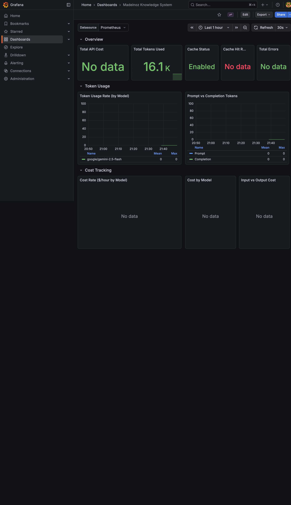
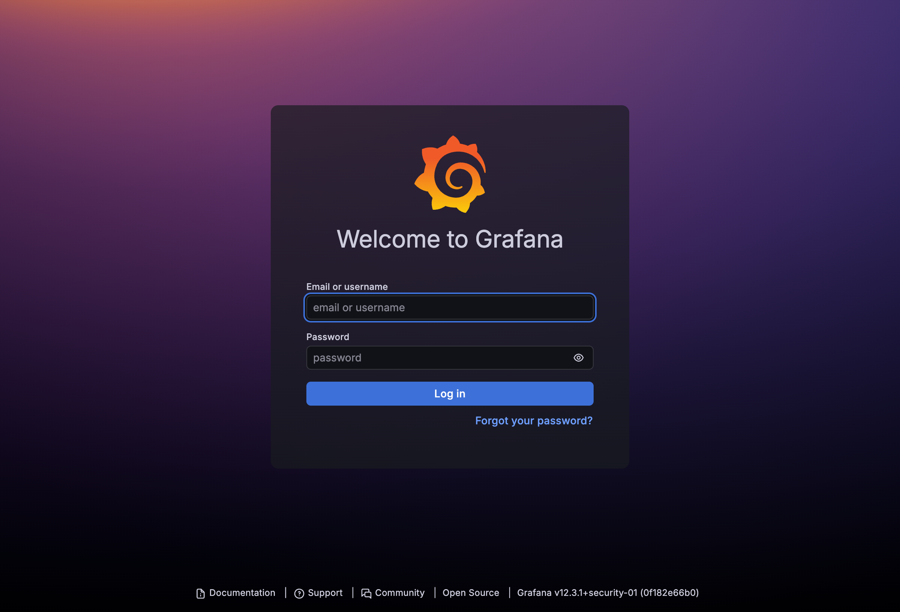
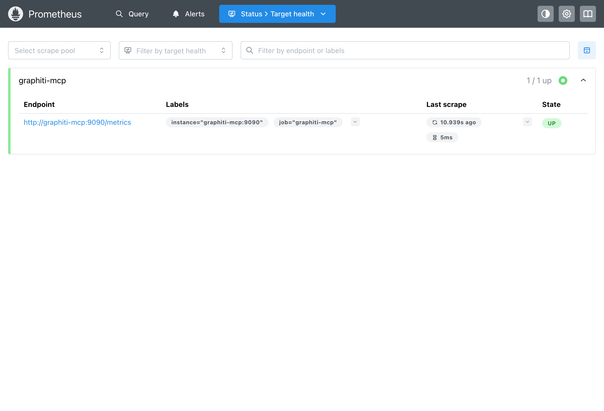

<!-- AI-FRIENDLY SUMMARY
System: Madeinoz Knowledge System Monitoring
Purpose: Real-time observability for MCP server metrics via Prometheus and Grafana
Key Components: Prometheus (metrics scraping), Grafana (visualization), graphiti-mcp (metrics source)

Key Commands:
- docker compose --profile monitoring up -d: Start monitoring in production
- bun run server start --dev: Start dev environment with monitoring enabled by default
- curl http://localhost:9090/metrics: Raw metrics endpoint

Ports (Dev): Grafana 3002/3003, Prometheus 9092, Metrics 9091
Ports (Prod): Grafana 3001/3002, Prometheus 9092, Metrics 9090 (internal)

Default Credentials: admin/admin (Grafana)
Dashboard: "Madeinoz Knowledge System" (auto-provisioned)
Refresh: 30 seconds auto-refresh

Metrics Categories:
- Token Usage: graphiti_prompt_tokens_total, graphiti_completion_tokens_total
- Cost: graphiti_request_cost_dollars (with model label)
- Duration: graphiti_request_duration_seconds (histogram)
- Cache: graphiti_cache_hit_total, graphiti_cache_miss_total
- Errors: graphiti_errors_total (with operation label)
-->

# Monitoring with Prometheus and Grafana

The Madeinoz Knowledge System includes a built-in monitoring stack to help you track token usage, costs, cache performance, and errors in real-time.



## What You'll See

The monitoring stack gives you visibility into:

- **Token usage** - How many tokens you're using across models
- **Costs** - Real-time cost tracking by model and operation
- **Performance** - Request durations and latency percentiles
- **Cache efficiency** - Hit rates and cached token savings
- **Errors** - Any failures that occur during operations

## Getting Started

### Development Environment

If you're running the development environment, monitoring is already enabled:

```bash
bun run server start --dev
```

Access the dashboards:

- **Grafana**: http://localhost:3002 (FalkorDB dev) or http://localhost:3003 (Neo4j dev)
- **Prometheus**: http://localhost:9092

### Production Environment

In production, monitoring is optional. Enable it with the `--profile` flag:

```bash
# Start with monitoring enabled
docker compose -f src/skills/server/docker-compose-falkordb.yml --profile monitoring up -d

# Or for Neo4j backend
docker compose -f src/skills/server/docker-compose-neo4j.yml --profile monitoring up -d
```

Access points:

- **Grafana**: http://localhost:3001 (Neo4j) or http://localhost:3002 (FalkorDB)
- **Prometheus**: http://localhost:9092

## Logging into Grafana

When you first access Grafana, you'll see the login screen:



**Default credentials:**

| Field | Value |
|-------|-------|
| Username | `admin` |
| Password | `admin` |

You'll be prompted to change the password on first login - you can skip this for local development.

## The Dashboard

After logging in, navigate to **Dashboards** in the left sidebar. You'll find the **Madeinoz Knowledge System** dashboard pre-configured.

The dashboard has six sections:

### Overview Row

Quick stats at a glance:

| Panel | What It Shows |
|-------|---------------|
| Total API Cost | Cumulative cost in dollars |
| Total Tokens Used | Combined prompt + completion tokens |
| Cache Status | Whether caching is enabled |
| Cache Hit Rate | Percentage of cache hits |
| Total Errors | Count of failed operations |

### Token Usage Row

Detailed token metrics:

- **Token Usage Rate** - Tokens per second by model
- **Prompt vs Completion** - Breakdown of input vs output tokens

### Cost Tracking Row

Financial metrics:

- **Cost Rate** - Dollars per hour by model
- **Cost by Model** - Pie chart of spending distribution
- **Input vs Output Cost** - Cost breakdown by token type

### Request Duration Row

Performance metrics:

- **Request Duration** - Response time histogram
- **Duration Percentiles** - P50, P90, P99 latencies
- **Requests per Second** - Throughput over time

### Cache Performance Row

Caching effectiveness:

- **Cache Hits vs Misses** - Hit rate visualization
- **Cached Tokens** - Tokens served from cache
- **Cache Efficiency** - Cost savings from caching

### Errors Row

Error tracking:

- **Errors by Type** - Breakdown by operation
- **Error Rate** - Errors per minute trend

## Verifying Prometheus is Working

You can check that Prometheus is scraping metrics correctly:



Navigate to http://localhost:9092/targets and verify:

- The **graphiti-mcp** target shows **UP** status
- Last scrape was recent (within 15 seconds)
- Scrape duration is low (typically <100ms)

## Checking Raw Metrics

To see the raw metrics being collected:

```bash
# From the host (dev environment)
curl http://localhost:9091/metrics

# Example output
graphiti_prompt_tokens_total{model="google/gemini-2.5-flash"} 12456
graphiti_completion_tokens_total{model="google/gemini-2.5-flash"} 3721
graphiti_cache_hit_total 847
graphiti_cache_miss_total 153
graphiti_request_duration_seconds_bucket{le="0.1"} 234
```

## Port Reference

| Service | Dev Port | Prod Port | Notes |
|---------|----------|-----------|-------|
| Grafana | 3002 (FalkorDB), 3003 (Neo4j) | 3001 (Neo4j), 3002 (FalkorDB) | Dashboard UI |
| Prometheus | 9092 | 9092 | Query interface |
| MCP Metrics | 9091 | 9090 (internal) | Scraped by Prometheus |

## Customizing the Dashboard

The dashboard is auto-provisioned but you can customize it:

1. Click **Edit** in the top-right corner
2. Modify panels, add queries, adjust time ranges
3. Click **Save dashboard** to persist changes

**Note:** Provisioned dashboards reset on container restart. To keep changes, export the dashboard JSON and save it to `config/monitoring/grafana/provisioning/dashboards/`.

## Environment Variables

| Variable | Default | Description |
|----------|---------|-------------|
| `GRAFANA_ADMIN_PASSWORD` | `admin` | Grafana admin password |

Set this in your `.env` file to change the default password:

```bash
# In $PAI_DIR/.env or ~/.claude/.env
GRAFANA_ADMIN_PASSWORD=your-secure-password
```

## Troubleshooting

### Grafana shows "No Data"

1. Check Prometheus is scraping successfully at http://localhost:9092/targets
2. Verify the MCP server is running: `docker ps | grep mcp`
3. Make some knowledge operations to generate metrics

### Can't connect to Grafana

1. Verify the container is running: `docker ps | grep grafana`
2. Check the correct port for your environment (dev vs prod, FalkorDB vs Neo4j)
3. Check container logs: `docker logs madeinoz-knowledge-grafana-dev`

### Prometheus target is DOWN

1. Check the MCP server is healthy: `curl http://localhost:8001/health`
2. Verify network connectivity between containers
3. Check Prometheus logs: `docker logs madeinoz-knowledge-prometheus-dev`

## Quick Reference

| Task | Command |
|------|---------|
| Start dev with monitoring | `bun run server start --dev` |
| Start prod with monitoring | `docker compose -f <compose-file> --profile monitoring up -d` |
| Stop monitoring only | `docker compose -f <compose-file> --profile monitoring down` |
| View Grafana | http://localhost:3002 (check port table above) |
| View Prometheus | http://localhost:9092 |
| Check targets | http://localhost:9092/targets |
| View raw metrics | `curl http://localhost:9091/metrics` |

## Next Steps

- Explore the [observability reference](../reference/observability.md) for detailed metric descriptions
- Learn about [advanced usage patterns](advanced.md) for optimization tips
- Explore [detailed metrics reference](../reference/observability.md) for all available metrics
