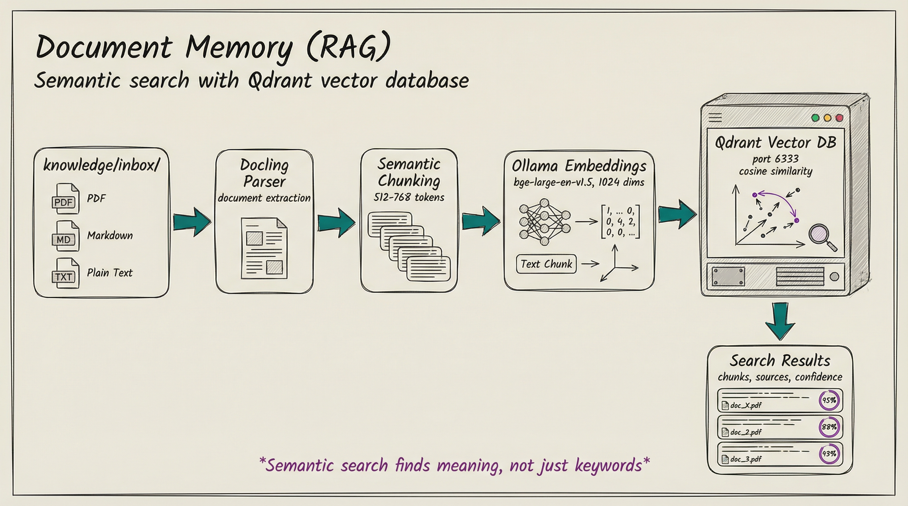

<!-- AI-FRIENDLY SUMMARY
System: Document Memory (RAG) - Qdrant Vector Search
Purpose: Self-hosted RAG for semantic document search
Component: Part 1 of LKAP Two-Tier Memory Model

Key Concepts:
- Drop documents in knowledge/inbox/ for automatic ingestion
- Docling parser extracts text from PDFs, markdown, text files
- Semantic chunking: 512-768 tokens with heading awareness
- Ollama embeddings: bge-large-en-v1.5 (1024 dimensions)
- Qdrant: 69MB Docker image, port 6333, cosine similarity search

Core Workflow:
1. Drop files in knowledge/inbox/
2. Ingest via rag.ingest() or CLI
3. Search with rag.search() or CLI
4. Results include chunks, source docs, confidence scores

MCP Tools:
- rag.search(query, filters, topK) - Semantic search
- rag.getChunk(chunkId) - Retrieve specific chunk
- rag.ingest(filePath, ingestAll) - Ingest documents
- rag.health() - Check Qdrant connectivity

Configuration Prefix: MADEINOZ_KNOWLEDGE_QDRANT_*
-->

# RAG Quickstart Guide

**Document Memory** - Fast semantic search across PDFs, markdown, and text documents using Qdrant vector database.

## What is Document Memory?

Document Memory provides RAG (Retrieval-Augmented Generation) capabilities for your knowledge system:

- **Drop documents** in `knowledge/inbox/` for automatic ingestion
- **Semantic search** finds relevant content even with different wording
- **Citations** show exactly where information came from
- **High-volume** storage for thousands of documents

## Quick Reference Card

| Task | Command/Action |
|------|----------------|
| **Start Qdrant** | `docker compose -f docker/docker-compose-qdrant.yml up -d` |
| **Ingest documents** | Drop files in `knowledge/inbox/` then run `rag.ingest(ingestAll=true)` |
| **Search documents** | `bun run src/skills/server/lib/rag-cli.ts search "<query>"` |
| **Get chunk details** | `bun run src/skills/server/lib/rag-cli.ts get-chunk <id>` |
| **List documents** | `bun run src/skills/server/lib/rag-cli.ts list` |
| **Check health** | `bun run src/skills/server/lib/rag-cli.ts health` |

## Architecture



Document flow: inbox → Docling parser → semantic chunking → Ollama embeddings → Qdrant → search results.

## Getting Started

### 1. Start Services

```bash
# Start Qdrant vector database
docker compose -f docker/docker-compose-qdrant.yml up -d

# Start Ollama (for local embeddings)
docker compose -f docker/docker-compose-ollama.yml up -d

# Verify services are healthy
bun run src/skills/server/lib/rag-cli.ts health
```

### 2. Ingest Documents

Drop documents in the inbox directory:

```bash
# Place documents for ingestion
cp ~/Downloads/datasheet.pdf knowledge/inbox/
cp ~/Documents/notes.md knowledge/inbox/
```

Then trigger ingestion via MCP tool:

```python
# Ingest all documents in inbox
rag.ingest(ingestAll=true)

# Or ingest a specific file
rag.ingest(filePath="datasheet.pdf")
```

After successful ingestion:
- Documents are moved to `knowledge/processed/`
- Chunks are stored in Qdrant with embeddings
- Original file hash is tracked for idempotency

### 3. Search Documents

Use the CLI or MCP tools:

```bash
# CLI search
bun run src/skills/server/lib/rag-cli.ts search "GPIO configuration"

# Search with filters
bun run src/skills/server/lib/rag-cli.ts search "interrupt handlers" --domain=embedded --top-k=5
```

Results include:
- Chunk text with source document
- Page/section reference
- Confidence score
- Metadata filters (domain, type, component)

## MCP Tools

### rag.search(query, filters, topK)

Semantic search across documents.

```python
rag.search(
    query="GPIO configuration",
    domain="embedded",
    component="gpio-driver",
    top_k=10
)
```

**Returns**:
- Chunk text with source document
- Page/section reference
- Confidence score (0.0-1.0)
- Metadata filters

### rag.getChunk(chunkId)

Retrieve specific chunk by ID.

```python
rag.getChunk(chunk_id="abc123-def456")
```

**Returns**:
- Full chunk text
- Document metadata
- Position and token count
- Section heading

### rag.ingest(filePath, ingestAll)

Ingest documents from inbox.

```python
# Ingest all documents in inbox
rag.ingest(ingest_all=True)

# Ingest specific file
rag.ingest(file_path="datasheet.pdf")
```

**Returns**:
- Document ID
- Chunk count
- Processing status
- Error message (if failed)

### rag.health()

Check Qdrant connectivity.

```python
rag.health()
```

**Returns**:
- Connection status
- Collection status
- Vector count

## Configuration

### Required Variables

```bash
# Qdrant API endpoint
MADEINOZ_KNOWLEDGE_QDRANT_URL=http://localhost:6333

# Qdrant collection name
MADEINOZ_KNOWLEDGE_QDRANT_COLLECTION=lkap_documents
```

### Optional Variables

```bash
# Qdrant Configuration
MADEINOZ_KNOWLEDGE_QDRANT_API_KEY=                    # For cloud deployments
MADEINOZ_KNOWLEDGE_QDRANT_CONFIDENCE_THRESHOLD=0.70
MADEINOZ_KNOWLEDGE_QDRANT_DEFAULT_TOP_K=10
MADEINOZ_KNOWLEDGE_QDRANT_MAX_TOP_K=100

# Chunking Configuration
MADEINOZ_KNOWLEDGE_QDRANT_CHUNK_SIZE_MIN=512
MADEINOZ_KNOWLEDGE_QDRANT_CHUNK_SIZE_MAX=768
MADEINOZ_KNOWLEDGE_QDRANT_CHUNK_OVERLAP=100

# Ollama Configuration (for local embeddings)
MADEINOZ_KNOWLEDGE_QDRANT_OLLAMA_URL=http://localhost:11434
MADEINOZ_KNOWLEDGE_QDRANT_OLLAMA_MODEL=bge-large-en-v1.5
```

### Security Configuration

```bash
# Database credentials (REQUIRED - no defaults)
MADEINOZ_KNOWLEDGE_NEO4J_PASSWORD=your-secure-password

# TLS verification (default: true for security)
MADEINOZ_KNOWLEDGE_QDRANT_TLS_VERIFY=true

# Rate limiting (requests per minute)
MADEINOZ_KNOWLEDGE_EMBEDDING_RATE_LIMIT=60
```

## CLI Reference

```bash
# Search documents
bun run src/skills/server/lib/rag-cli.ts search "<query>"

# Search with filters
bun run src/skills/server/lib/rag-cli.ts search "<query>" --domain=embedded --type=pdf --component=gpio

# Get chunk details
bun run src/skills/server/lib/rag-cli.ts get-chunk <chunk-id>

# List all documents
bun run src/skills/server/lib/rag-cli.ts list

# List with limit
bun run src/skills/server/lib/rag-cli.ts list --limit=50

# Check health
bun run src/skills/server/lib/rag-cli.ts health

# Show help
bun run src/skills/server/lib/rag-cli.ts help
```

## Document Storage

| Directory | Purpose |
|-----------|---------|
| `knowledge/inbox/` | Drop documents here for ingestion |
| `knowledge/processed/` | Canonical storage after ingestion |

**Supported Formats**:
- **PDF**: `.pdf` files (parsed via Docling)
- **Markdown**: `.md`, `.mdx` files
- **Text**: `.txt` files

## Troubleshooting

### Qdrant connection failed

```bash
# Check Qdrant is running
docker ps | grep qdrant

# Check logs
docker logs qdrant

# Restart if needed
docker compose -f docker/docker-compose-qdrant.yml restart
```

### Documents not ingesting

```bash
# Check inbox directory exists
ls -la knowledge/inbox/

# Check file permissions
chmod 644 knowledge/inbox/*

# Check MCP server logs for errors
docker logs madeinoz-knowledge-mcp
```

### Search returns no results

```bash
# Verify documents are ingested
bun run src/skills/server/lib/rag-cli.ts list

# Check health
bun run src/skills/server/lib/rag-cli.ts health

# Lower confidence threshold if needed
MADEINOZ_KNOWLEDGE_QDRANT_CONFIDENCE_THRESHOLD=0.60
```

### Ollama embeddings failing

```bash
# Check Ollama is running
curl http://localhost:11434/api/tags

# Pull the embedding model if needed
ollama pull bge-large-en-v1.5

# Check Ollama logs
docker logs ollama
```

## Next Steps

- **[Knowledge Graph Guide](../concepts/knowledge-graph.md)** - Promote facts from documents to durable knowledge
- **[LKAP Overview](lkap-quickstart.md)** - Two-tier memory model overview
- **[Configuration Reference](../reference/configuration.md#qdrant-configuration) - Complete environment variables
