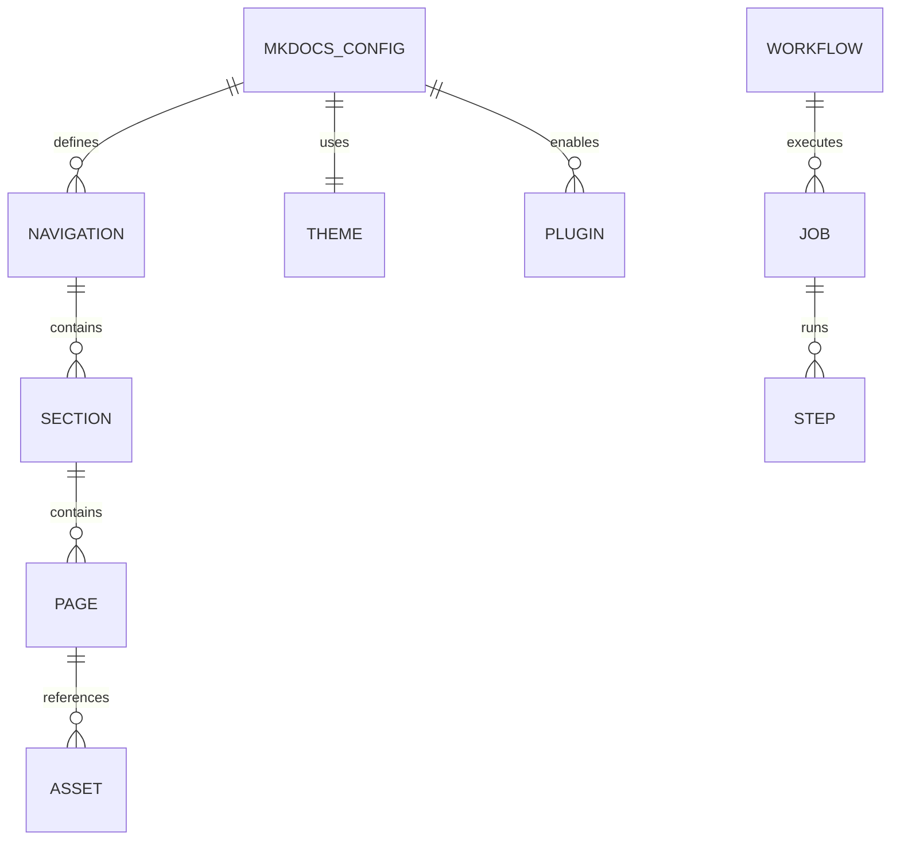

# Phase 1: Data Model - MkDocs Material Documentation Site

**Feature**: 002-mkdocs-documentation
**Date**: 2026-01-19
**Status**: Complete

## Overview

This document defines the data structures and configuration schemas for the MkDocs Material documentation site implementation. Since this is a static documentation site, the "data model" consists primarily of configuration files and directory structures rather than database schemas.

## Configuration Schema

### mkdocs.yml

The primary configuration file for the documentation site.

```yaml
# Schema: MkDocs Material Configuration
# Version: 1.0.0

site_name: string                    # Required: Display name of the documentation
site_description: string             # Optional: Site description for SEO
site_author: string                  # Optional: Author name
site_url: string                     # Optional: Canonical URL

repo_name: string                    # Optional: GitHub repository name
repo_url: string                     # Optional: GitHub repository URL

theme:
  name: "material"                   # Required: Theme name (always "material")
  palette:                           # Required: Color scheme configuration
    - scheme: default|slate          # Light/dark mode
      primary: string                # Primary color
      accent: string                 # Accent color
      toggle:
        icon: string                 # Toggle icon path
        name: string                 # Toggle label
  features: string[]                 # Optional: Theme features
  logo: string                       # Optional: Path to logo
  favicon: string                    # Optional: Path to favicon

nav: NavigationItem[]                # Required: Site navigation structure

plugins: string[]                    # Optional: MkDocs plugins

markdown_extensions: string[]        # Optional: Markdown extensions

extra:                               # Optional: Extra configuration
  social: SocialLink[]               # Optional: Social links in footer
```

### Navigation Structure

```typescript
// NavigationItem type definition
type NavigationItem =
  | string                           // Simple page: "page.md"
  | { [title: string]: string }      // Page with custom title: { "Title": "page.md" }
  | { [section: string]: NavigationItem[] }  // Section with children
```

### Directory Structure Model

```text
repository-root/
├── mkdocs.yml                       # [CONFIG] Primary configuration
├── docs/                            # [CONTENT] Documentation source
│   ├── index.md                     # [PAGE] Homepage
│   ├── assets/                      # [ASSETS] Static files
│   │   ├── logo.png                 # [IMAGE] Site logo
│   │   ├── favicon.ico              # [IMAGE] Browser favicon
│   │   └── images/                  # [IMAGES] Page images
│   ├── getting-started/             # [SECTION] Getting started pages
│   │   ├── overview.md              # [PAGE]
│   │   └── quick-reference.md       # [PAGE]
│   ├── installation/                # [SECTION] Installation pages
│   │   ├── index.md                 # [PAGE] Section index
│   │   ├── requirements.md          # [PAGE]
│   │   └── verification.md          # [PAGE]
│   ├── usage/                       # [SECTION] Usage pages
│   │   ├── basic-usage.md           # [PAGE]
│   │   └── advanced.md              # [PAGE]
│   ├── concepts/                    # [SECTION] Concept pages
│   │   ├── architecture.md          # [PAGE]
│   │   └── knowledge-graph.md       # [PAGE]
│   ├── troubleshooting/             # [SECTION] Troubleshooting pages
│   │   └── common-issues.md         # [PAGE]
│   └── reference/                   # [SECTION] Reference pages
│       ├── cli.md                   # [PAGE]
│       ├── configuration.md         # [PAGE]
│       ├── model-guide.md           # [PAGE]
│       └── benchmarks.md            # [PAGE]
├── .github/
│   └── workflows/
│       └── docs.yml                 # [WORKFLOW] Deployment workflow
└── site/                            # [BUILD] Generated output (gitignored)
```

## Page Frontmatter Schema

All markdown pages should include YAML frontmatter:

```yaml
---
title: string                        # Required: Page title
description: string                  # Optional: Page description for SEO
tags: string[]                       # Optional: Tags for search
---
```

## GitHub Actions Workflow Schema

```yaml
# .github/workflows/docs.yml schema
name: string                         # Workflow name

on:
  push:
    branches: string[]               # Trigger branches
    paths: string[]                  # Optional: Path filters
  workflow_dispatch: {}              # Manual trigger

permissions:
  contents: read                     # Read repository
  pages: write                       # Write to Pages
  id-token: write                    # OIDC token

concurrency:
  group: string                      # Concurrency group
  cancel-in-progress: boolean        # Cancel queued runs

jobs:
  build:
    runs-on: string                  # Runner environment
    steps: Step[]                    # Build steps

  deploy:
    needs: string[]                  # Job dependencies
    environment:
      name: string                   # Environment name
      url: string                    # Deployment URL
    steps: Step[]                    # Deploy steps
```

## Entity Relationships



## Migration Mapping

### Source → Target File Mapping

| Source File | Target File | Action |
|-------------|-------------|--------|
| `README.md` (root) | `docs/index.md` | Extract overview |
| `README.md` (root) | `docs/concepts/architecture.md` | Extract architecture |
| `INSTALL.md` | `docs/installation/index.md` | Copy with updates |
| `VERIFY.md` | `docs/installation/verification.md` | Copy |
| `docs/INDEX.md` | `docs/index.md` | Merge |
| `docs/README.md` | `docs/getting-started/overview.md` | Rename |
| `docs/installation.md` | `docs/installation/requirements.md` | Split |
| `docs/usage.md` | `docs/usage/basic-usage.md` | Move |
| `docs/concepts.md` | `docs/concepts/knowledge-graph.md` | Move |
| `docs/troubleshooting.md` | `docs/troubleshooting/common-issues.md` | Move |
| `docs/QUICK_REFERENCE.md` | `docs/getting-started/quick-reference.md` | Move |
| `docs/OLLAMA-MODEL-GUIDE.md` | `docs/reference/model-guide.md` | Move |
| `docs/MODEL-BENCHMARK-RESULTS.md` | `docs/reference/benchmarks.md` | Move |

## Validation Rules

### mkdocs.yml Validation
- `site_name` must be non-empty string
- `theme.name` must be "material"
- `nav` must contain at least one entry
- All paths in `nav` must exist in `docs/`

### Page Validation
- All pages must have `.md` extension
- All internal links must resolve to existing pages
- All image references must resolve to existing files
- Code blocks should have language identifiers

### Build Validation
- `mkdocs build --strict` must pass without errors
- All warnings should be addressed
- Generated `site/` directory should contain valid HTML

## Configuration Constants

```yaml
# Constant values for this implementation
MKDOCS_VERSION: "1.6+"
MATERIAL_VERSION: "9.5+"
PYTHON_VERSION: "3.x"
BUILD_DIRECTORY: "site"
SOURCE_DIRECTORY: "docs"
CONFIG_FILE: "mkdocs.yml"
WORKFLOW_FILE: ".github/workflows/docs.yml"
PAGES_BRANCH: "gh-pages"  # Legacy, now using Actions
```

## Success Criteria Mapping

| Data Model Element | Success Criteria |
|--------------------|------------------|
| `mkdocs.yml` | SC-004: Builds and deploys automatically |
| Navigation structure | SC-007: 6+ major sections |
| Page files | SC-002: All 11 files migrated |
| Theme config | SC-008: Dark/light toggle |
| Search plugin | SC-003: Search returns relevant results |
| Workflow file | SC-001: Site accessible within 5 minutes |
